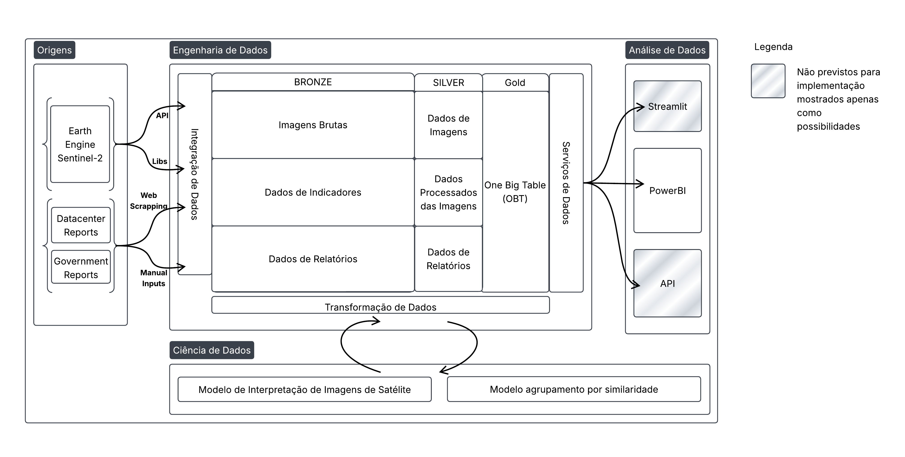
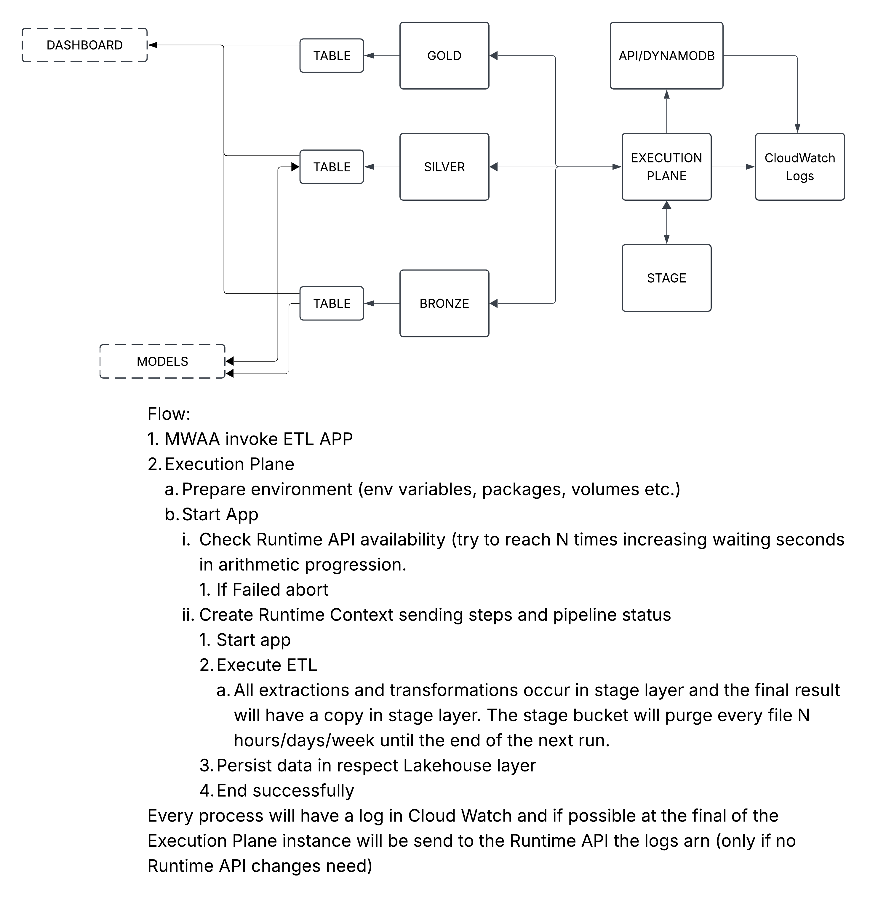

# Arquitetura

Esta página apresenta a arquitetura do **Sentinela Verde — Monitoramento Geoespacial de Data Centers** sob três perspectivas complementares: a implantação física na AWS, a organização conceitual do fluxo de dados e o ciclo de vida operacional dos workloads de ETL e modelos.

!!! info "🧭 Nota"
    A arquitetura foi projetada para manter o estado persistente em serviços gerenciados e executar processamento de forma efêmera. O **Amazon MWAA Serverless** coordena os workflows, enquanto os workloads são empacotados em imagens Docker imutáveis e executados em **instâncias EC2 Spot temporárias**, em sub-rede privada. Dados governados, artefatos técnicos, logs e metadados de execução permanecem fora das instâncias.

## Arquitetura AWS

*Figura — Arquitetura física da plataforma e seus principais serviços AWS.*
A visão física mostra como os componentes da solução são distribuídos na AWS e como se relacionam com o ciclo de desenvolvimento. O código é versionado no GitHub, validado por **GitHub Actions** e empacotado em imagens Docker imutáveis publicadas no **Amazon ECR**. O **Amazon MWAA Serverless** orquestra as execuções e aciona diretamente recursos computacionais efêmeros em **EC2 Spot**.
Os workloads executam em **sub-rede privada**, sem IP público e sem NAT Gateway como solução padrão. O acesso a serviços internos da AWS ocorre por **VPC Endpoints** para S3, ECR e CloudWatch Logs. Quando uma carga precisa acessar uma fonte HTTPS externa, essa necessidade é tratada como dependência explícita de arquitetura e deve utilizar um mecanismo de egress/proxy aprovado.

| Componente | Responsabilidade |
| --- | --- |
| **GitHub / GitHub Actions** | Versionamento, validação, CI/CD e publicação de artefatos imutáveis. |
| **Amazon ECR** | Registro das imagens Docker utilizadas pelos workloads. |
| **Amazon MWAA Serverless** | Orquestração dos workflows de ETL e modelos. |
| **EC2 Spot** | Execução efêmera dos containers de processamento. |
| **Amazon S3** | Persistência de dados governados, artefatos técnicos e definições operacionais, separados por finalidade. |
| **AWS Glue Data Catalog / Athena** | Catálogo das tabelas e consultas analíticas sobre o Lakehouse. |
| **CloudWatch** | Logs operacionais, falhas e telemetria dos workloads e da infraestrutura. |
| **IAM / VPC** | Isolamento de rede, identidade dos workloads e aplicação do princípio de menor privilégio. |

## Arquitetura conceitual

*Figura — Visão conceitual do fluxo de dados, modelagem e consumo analítico.*
O diagrama originalmente identificado como **“arquitetura lógica”** representa, na prática, uma **arquitetura conceitual**. Seu objetivo é abstrair os detalhes de infraestrutura e mostrar como dados provenientes de diferentes fontes evoluem até se tornarem resultados analíticos consumíveis.
O fluxo conceitual é organizado da seguinte forma:
1. **Aquisição e ingestão:** coleta dos dados de data centers, geocodificação, imagens de satélite, rótulos de cobertura do solo e indicadores socioeconômicos.
2. **Bronze:** preservação da identidade, proveniência e estrutura das fontes, incluindo objetos raster quando Iceberg não for a representação adequada.
3. **Silver:** padronização, integração, entidades canônicas, features reutilizáveis, métricas derivadas e **saídas técnicas de modelos**.
4. **Gold:** aplicação de regras de negócio, consolidação de métricas, resultados estatísticos, KPIs e datasets orientados ao consumo.
5. **Consumo:** consultas analíticas, dashboard e materiais de interpretação dos resultados.

| Camada | Responsabilidade |
| --- | --- |
| **Bronze** | Dados alinhados às fontes, com proveniência e rastreabilidade preservadas. |
| **Silver** | Dados canônicos e curados, features reutilizáveis e saídas técnicas de modelos. |
| **Gold** | Visões analíticas, regras de negócio, indicadores e produtos orientados ao consumo. |

Essa separação mantém a responsabilidade de cada camada explícita e evita que artefatos técnicos de modelagem sejam confundidos com produtos analíticos finais.

## Ciclo de vida das aplicações

*Figura — Ciclo de vida de ETLs e modelos, da publicação até a execução e persistência dos resultados.*
O ciclo de vida operacional é o mesmo para workloads de ETL e de modelagem; o que varia são os recursos computacionais e as permissões necessárias para cada responsabilidade.
1. **Desenvolvimento:** o código e as configurações são versionados no repositório do workload.
2. **Validação e publicação:** o GitHub Actions executa as validações, constrói a imagem Docker e publica uma referência imutável no ECR.
3. **Definição da execução:** o workflow do MWAA referencia a imagem, os parâmetros, a IAM Role/instance profile, a sub-rede privada e os Security Groups aprovados.
4. **Provisionamento:** o MWAA Serverless solicita diretamente a instância EC2 Spot necessária à execução; não existe uma Lambda dedicada exclusivamente ao lançamento do worker.
5. **Execução:** o container obtém a imagem pelo ECR, acessa apenas os dados e serviços autorizados e processa a carga de trabalho.
6. **Persistência:** dados governados são gravados no Lakehouse; modelos, checkpoints e artefatos técnicos são enviados ao bucket de artifacts; logs seguem para o CloudWatch.
7. **Rastreabilidade:** a execução é correlacionada por `execution_id`, commit Git, contrato, snapshots de entrada/saída e, quando aplicável, versão ou digest do modelo.
8. **Encerramento:** após a conclusão ou falha controlada, a instância Spot é descartada. Nenhum estado de negócio deve depender do disco local do worker.

!!! success "♻️ Nota"
    Esse padrão reduz infraestrutura persistente, mantém os workloads reproduzíveis e desacopla a evolução de cada ETL ou modelo da infraestrutura compartilhada da plataforma.

## Armazenamento e persistência

O Amazon S3 é separado por responsabilidade para evitar a mistura entre dados governados e artefatos operacionais.

| Armazenamento | Conteúdo |
| --- | --- |
| **Lakehouse** | Dados governados nas camadas `bronze`, `silver` e `gold`, com tabelas Apache Iceberg/Parquet e objetos raster governados quando aplicável. |
| **Artifacts** | Modelos serializados, checkpoints, resultados temporários, outputs de execução, resultados do Athena e estados do Terraform. |
| **MWAA** | Definições de workflows e arquivos necessários à orquestração. |

Artefatos binários de modelos não são tratados como tabelas do Lakehouse. As **saídas técnicas dos modelos**, quando representadas como dados governados, pertencem à camada Silver; apenas resultados analíticos e regras de negócio são promovidos à Gold.

## Rede, segurança e observabilidade

A plataforma aplica isolamento de rede e menor privilégio como padrões de projeto. Cada workload recebe identidade própria e permissões limitadas aos recursos necessários à sua execução. Os containers não carregam credenciais AWS estáticas.
A observabilidade operacional é centralizada no **CloudWatch**, enquanto o estado complementar do `servico-runtime`, quando utilizado, é persistido pelo mecanismo operacional previsto para esse serviço. A arquitetura-alvo não depende de MLflow nem PostgreSQL para orquestração ou governança dos modelos; métricas, checkpoints e artefatos de avaliação são versionados nos mecanismos definidos para cada workload.

## Princípios operacionais

- **Orquestração gerenciada:** MWAA Serverless coordena os workflows sem exigir uma EC2 persistente de plano de controle.
- **Computação efêmera:** ETLs e modelos executam em EC2 Spot e não mantêm estado local após a execução.
- **Artefatos imutáveis:** imagens Docker são identificadas por SHA/digest e não dependem de `latest` como referência de execução.
- **Um writer por tabela:** cada tabela governada possui responsabilidade de escrita explícita.
- **Persistência fora do worker:** dados, artefatos, logs e metadados sobrevivem independentemente da instância de execução.
- **Rede privada por padrão:** acesso interno a serviços AWS é realizado por VPC Endpoints; conectividade externa é tratada explicitamente.
- **Rastreabilidade ponta a ponta:** código, dados, contrato, execução e modelo podem ser correlacionados para reprodução e auditoria.

## Detalhamento por perspectiva

As páginas abaixo aprofundam os diferentes recortes da arquitetura sem repetir toda a visão consolidada desta página.

- [01. Visão Conceitual](visao-conceitual.md)

- [02. Plataforma AWS](plataforma-aws.md)

- [03. Arquitetura de Dados](arquitetura-dados.md)

- [04. Modelagem e Análise](modelagem-analise.md)
