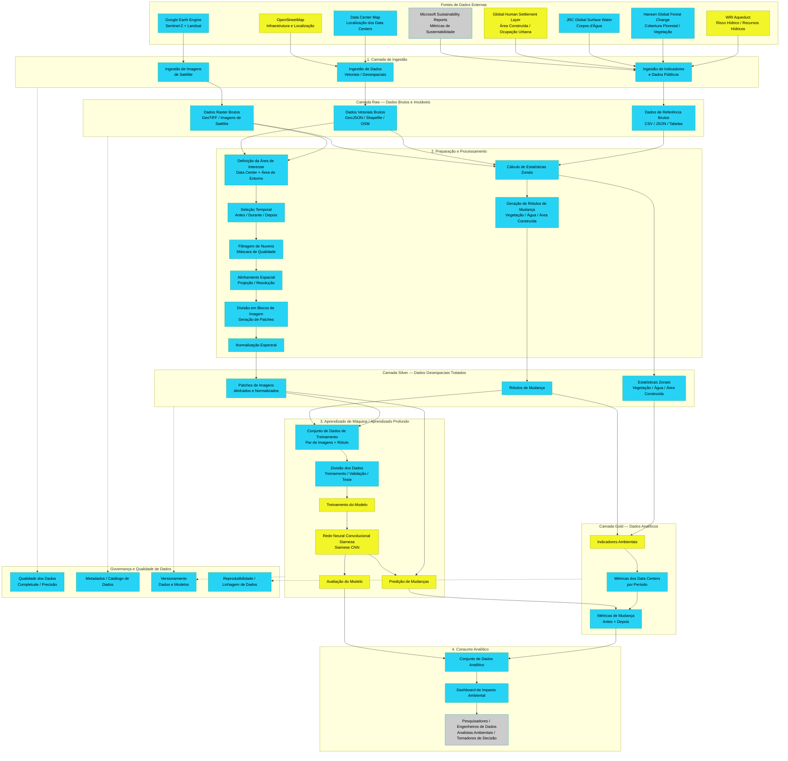

# Arquitetura Inicial

!!! warning "Registro histórico"
    Esta página preserva o conteúdo do checkpoint em seu estado original. Decisões de arquitetura vigentes estão na [documentação atual](../arquitetura/index.md).

[https://mermaid.ai/d/e548e6a5-baf0-4c08-82cc-1b343861bce0](https://mermaid.ai/d/e548e6a5-baf0-4c08-82cc-1b343861bce0)

