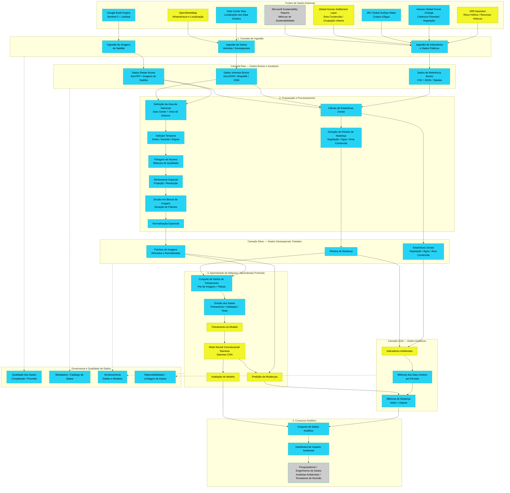

# Sprint 1 — 11/08 a 17/08

!!! warning "Registro histórico"
    Esta página preserva o conteúdo do checkpoint em seu estado original. Decisões de arquitetura vigentes estão na [documentação atual](../arquitetura/index.md).

??? note "Comentários professor sobre entrega (2026-08-18)"
    ## **1. Cuidado com a palavra “impacto”**
    Não afirmar que o data center **causou** determinada alteração ambiental.
    - O data center pode estar associado a mudanças na região.
    - As mudanças podem ter sido causadas por um processo maior de desenvolvimento urbano.
    - Preferir termos como **“mudanças”, “transformações” ou “variações ambientais e territoriais”**.
    **Exemplo:**
    Em vez de “medir o impacto ambiental do data center”, usar **“identificar e quantificar mudanças ambientais e territoriais no entorno do data center”.**
    ## **2. Criar uma área de comparação**
    Além de comparar **antes × depois**, utilizar uma **área semelhante que não recebeu um data center**.
    A ideia é responder:
    > A região com data center mudou mais do que uma região semelhante sem data center?
    Também manter a análise por diferentes distâncias:
    - 1 km
    - 5 km
    - 10 km
    ## **3. Considerar a amostra pequena**
    Com apenas **4 a 6 data centers**, o projeto deve ser apresentado como **exploratório**, sem buscar validação ou generalização estatística para todos os data centers.
    Isso precisa ser uma limitação explícita do projeto.
    ## **4. Cuidado com o modelo de Machine Learning**
    Mesmo gerando muitos patches, eles vêm de poucos data centers. Existe o risco de o modelo aprender características específicas desses locais.
    Por isso, é importante avaliar:
    > **O modelo consegue generalizar para um data center que não participou do treinamento ou precisa ser recalibrado?**
    Idealmente, separar treinamento e teste por **data center**, e não apenas por patch.
    ## **5. Controlar a sazonalidade**
    As diferenças entre imagens podem ser causadas pela **época do ano**, e não por uma mudança real.
    Por isso:
    - comparar períodos semelhantes do ano;
    - controlar diferenças climáticas quando possível;
    - preferir composições de várias imagens em vez de uma única imagem.

??? note "Requisitos"
    - [x] Definição do problema e escolha do caso de uso.
    - [x] Criação do Kanban no Trello ou Jira para organização das tarefas.
    - [x] Desenho inicial da arquitetura.
    - [x] Seleção e avaliação das bases de dados.
    - [x] Escolha das ferramentas e tecnologias a serem utilizadas.

**BRIEFING DO PROJETO INTEGRADOR**
**Disciplina: Hands-On Fundamentos de Dados e Analytics**
Módulo 1 – MBA em Engenharia de Dados – Universidade Presbiteriana Mackenzie
**Mentoria: **Prof. Gustavo Ferreira

## 1. IDENTIFICAÇÃO DO GRUPO

**Nome do Projeto: Sentinela Verde — Monitoramento Geoespacial de Data Centers**
**Setor de Atuação: **Setor Público / Meio Ambiente
**Integrantes:**
- Fabio Olivetto Mesquita 10747149
- Fernando Sousa Silva 10739880
- Gabriel Barbosa de Souza 10747173
- Guilherme Giovanetti Cuzner 10204618
- Natan Milanez Polly 10747137
- Taimara Liz de Souza 10369003

## 2. DESCRIÇÃO DO PROBLEMA DE NEGÓCIO

#### 2.1 Qual é o problema que vocês pretendem resolver?

Analisar a transformação ambiental e territorial de uma área antes, durante e após a criação de um data center, utilizando imagens de satélite e um pipeline de Engenharia de Dados. Esses empreendimentos ocupam grandes extensões de terreno e demandam infraestrutura elétrica e hídrica intensiva, gerando impactos ambientais no entorno dessas instalações, como a perda de cobertura vegetal e alterações em corpos d'água próximos.

#### 2.2 Qual é o impacto do problema para o negócio?

A expansão dos data centers, impulsionada pelo crescimento da computação em nuvem, da inteligência artificial e do volume de dados, demanda grandes quantidades de energia, água e infraestrutura territorial. Esse crescimento gera impactos ambientais e socioeconômicos nas regiões onde são instalados, criando riscos relacionados à disponibilidade de recursos, à sustentabilidade, à infraestrutura local e à aceitação social. É importante que as empresas se responsabilizem, compreendam e mensurem esses impactos para tomar decisões de localização, planejamento e expansão de data centers de forma mais sustentável e responsável.

## 3. OBJETIVOS DO PROJETO

#### 3.1 Objetivo Geral:

Desenvolver um produto de dados para analisar dados geoespaciais, integrado a técnicas de Machine Learning, com o objetivo de identificar e quantificar alterações ambientais e territoriais no entorno de data centers, a partir da análise comparativa de imagens de satélite anteriores e posteriores à sua instalação, considerando mudanças na cobertura vegetal, nos corpos d'água e na área construída.

#### 3.2 Objetivos Específicos:

1. Levantamento dos casos: Identificar e caracterizar estudos de caso de data centers, considerando localização geográfica, período aproximado de instalação e disponibilidade de dados públicos e imagens de satélite.
2. Aquisição dos dados: Obter, por meio do Google Earth Engine, imagens históricas dos satélites Sentinel-2 e Landsat correspondentes aos períodos anterior e posterior à instalação dos data centers selecionados.
3. Construção do pipeline: Desenvolver um pipeline de ingestão, tratamento, padronização e transformação dos dados geoespaciais, convertendo as informações provenientes das imagens de satélite em dados estruturados e indicadores quantitativos.
4. Treinar e validar um modelo de deep learning (rede neural convolucional siamesa) capaz de detectar automaticamente essas mudanças a partir de pares de imagens de satélite, comparando seu desempenho com os indicadores de referência.
5. Consolidar os resultados em um dashboard analítico que apresente, por data center estudado, os indicadores de impacto ambiental antes e depois da instalação.

## 4. DADOS UTILIZADOS

#### 4.1 Fonte de Dados:

- Posição de data center: [https://www.datacentermap.com/](https://www.datacentermap.com/)
- Download de dados brutos: WRI Aqueduct Platform
- Histórico de métricas de nuvem: Microsoft Sustainability Report
- Google Earth Engine (imagens Sentinel-2 e Landsat)
- Hansen Global Forest Change (University of Maryland)
- JRC Global Surface Water (Comissão Europeia)
- Global Human Settlement Layer – GHSL (Comissão Europeia)
- OpenStreetMap (infraestrutura e localização)

#### 4.2 Descrição da base:

**Número de registros: **Estimativa inicial de 4 a 6 data centers como estudos de caso, recortados em múltiplos patches de imagem (ex.: 256 × 256 pixels) dentro de anéis de 10 km de raio, gerando uma base estimada de algumas centenas a poucos milhares de patches para treinamento.
**Número de atributos: **3 a 4 bandas espectrais por patch (RGB e infravermelho próximo); cerca de 8 a 10 variáveis analíticas tabulares derivadas por área estudada.
**Período coberto: **variável por data center, conforme a data de instalação; Sentinel-2 disponível desde 2015 e Landsat desde a década de 1980, permitindo comparações de longo prazo quando necessário.

#### 4.3 Principais variáveis:

- Identificação e localização (latitude/longitude) do data center
- Data aproximada de instalação
- Raio do anel de análise (buffer: 1 km, 5 km e 10 km)
- % de cobertura vegetal, antes e depois
- % de área de corpos d'água, antes e depois
- % de área construída, antes e depois
- Variação (delta) de cada indicador entre os dois períodos
- Classe de mudança prevista pelo modelo (por pixel/patch)

## 5. ARQUITETURA E GOVERNANÇA

- [Arquitetura Inicial](sprint-1-arquitetura-inicial.md)

[https://mermaid.ai/d/e548e6a5-baf0-4c08-82cc-1b343861bce0](https://mermaid.ai/d/e548e6a5-baf0-4c08-82cc-1b343861bce0)

#### 5.1 Representação do fluxo de dados (camadas):

1. Ingestão (Google Earth Engine, OpenStreetMap e fontes públicas de localização)
2. Preparação (recorte de imagens, geração de patches, cálculo de estatísticas zonais e rótulos de mudança)
3. Armazenamento (arquivos raster/GeoTIFF e tabelas Parquet/CSV)
4. Modelagem (treinamento da rede neural siamesa)
5. Visualização (dashboard com indicadores por data center)

#### 5.2 Simulação de camadas de dados:

- Camada bruta (raw): imagens de satélite originais e vetores do OpenStreetMap, sem tratamento.
- Camada tratada (silver): patches recortados, alinhados espacialmente e normalizados, com rótulos de mudança associados.
- Camada analítica (gold): indicadores agregados por data center e período, prontos para consumo do dashboard e da etapa de modelagem.

#### 5.3 Princípios de Governança aplicados:

- Catálogo de dados: Glue Data Catalog
- Políticas de acesso: IAM / Lake Formation
- LGPD (simulado): não se aplica diretamente, pois não há dados pessoais envolvidos, apenas dados geoespaciais públicos.
- Classificação de sensibilidade

## 6. ANÁLISE EXPLORATÓRIA

#### 6.1 Técnicas utilizadas:

- Estatística descritiva: médias, medianas e desvios dos indicadores de vegetação, água e área construída, antes e depois da instalação.
- Visualização gráfica: séries antes/depois por data center.
- Correlação entre variáveis (ex.: relação entre crescimento urbano e perda de vegetação).
- Análise espacial por zonas de influência (buffer), comparando o impacto em diferentes raios de distância do data center: 1 km, 5 km e 10 km.

#### 6.2 Ferramentas utilizadas:

- Python como linguagem principal, com bibliotecas de dados geoespaciais (GeoPandas, Rasterio, Shapely)
- Google Earth Engine (earthengine-api, geemap)
- Extração de dados do OpenStreetMap (osmnx)
- Análise e visualização (Pandas, NumPy, Matplotlib, Seaborn, scikit-image)
- Modelagem (TensorFlow/Keras para a rede siamesa, scikit-learn para o Random Forest)

## 7. MODELAGEM PREDITIVA

#### 7.1 Tipo de problema modelado:

- Classificação
- Regressão

#### 7.2 Algoritmo(s) utilizados:

- Rede Neural Convolucional Siamesa (Change Detection)

#### 7.3 Métricas utilizadas para validação:

- Accuracy
- Precision
- Recall
- F1 Score
- MAE
- RMSE

## 8. DASHBOARD FINAL

#### 8.1 Ferramenta utilizada:

- Looker Studio ou Preset.io

#### 8.2 Público-alvo do dashboard:

- Diretoria
- Stakeholders técnicos

#### 8.3 Principais KPIs apresentados:

- % de perda/ganho de cobertura vegetal no entorno do data center
- Variação percentual da área de corpos d'água
- Taxa de crescimento da área construída (urbanização)
- Número de data centers monitorados no estudo
- Grau de concordância (acurácia) entre o modelo treinado e os datasets de referência

## 9. DOCUMENTAÇÃO E APRESENTAÇÃO FINAL

#### 9.1 Repositório GitHub do projeto (link):

- Pipeline de dados:
- Modelo:
- Infraestrutura:
- Kanban: [https://github.com/users/BigDataNatan/projects/3/views/3](https://github.com/users/BigDataNatan/projects/3/views/3)

#### 9.2 Componentes do repositório:

☒ README com visão geral
☒ Código-fonte (Python, SQL, etc.)
☒ Notebook técnico
☒ Slides de apresentação
☒ Artefatos complementares (ex.: GeoJSON dos buffers, CSV dos indicadores)

#### 9.3 Observações e aprendizados do grupo:
