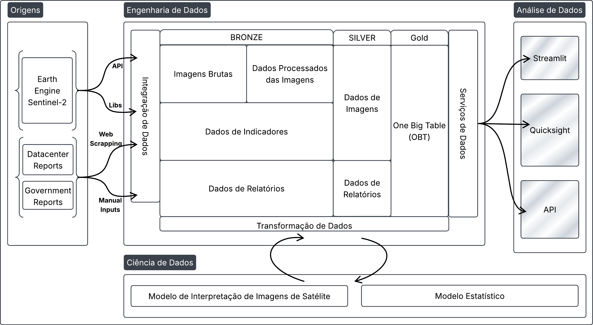
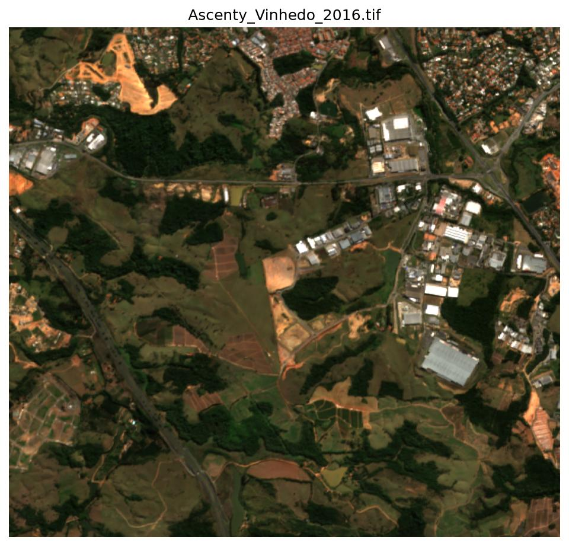
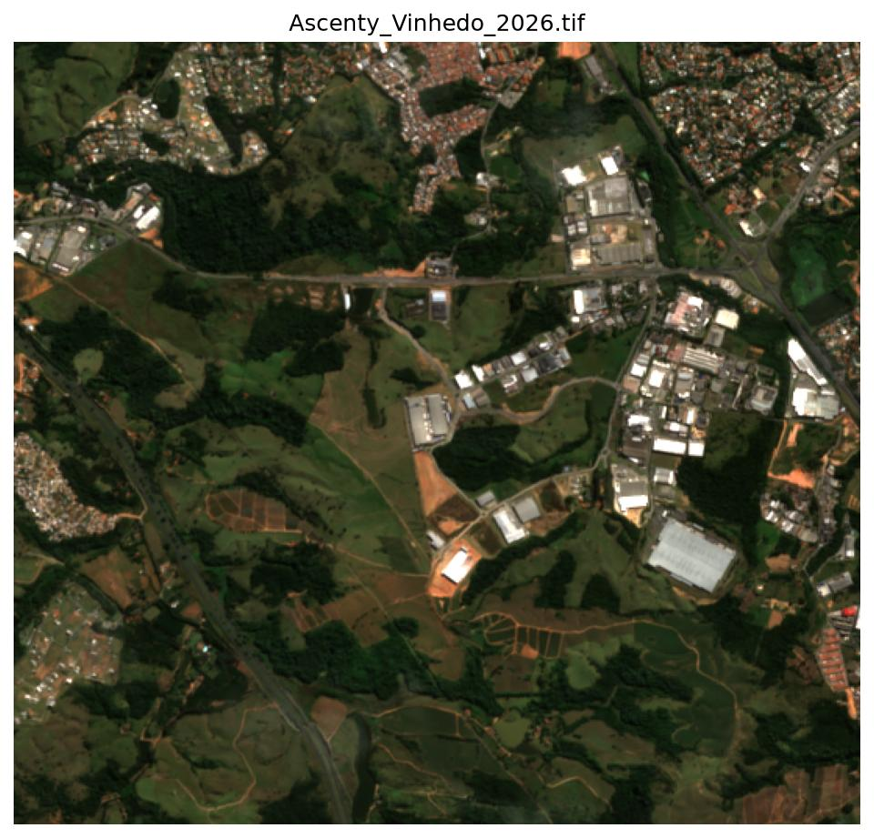
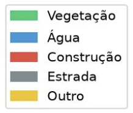
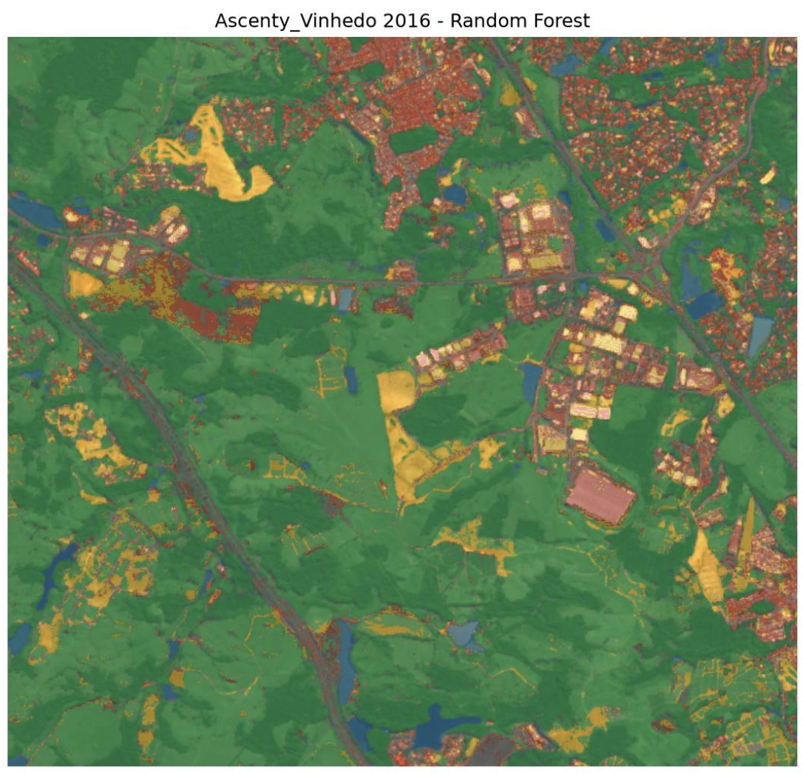
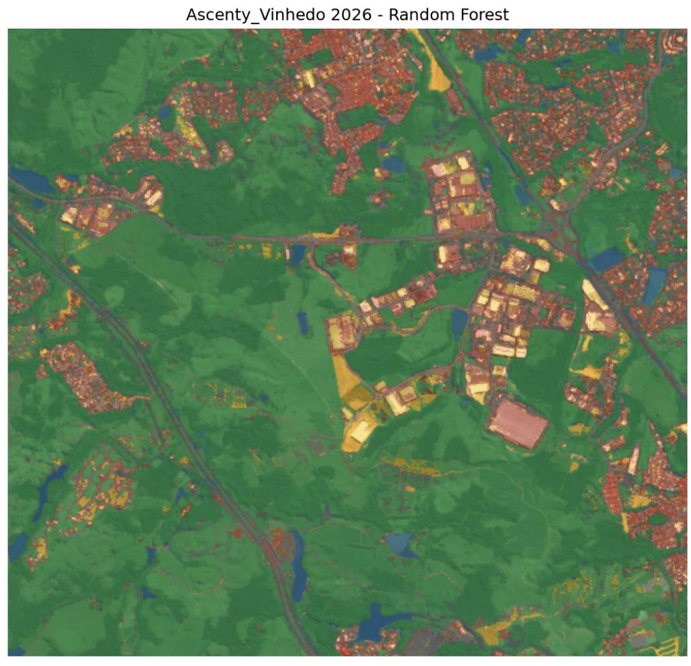
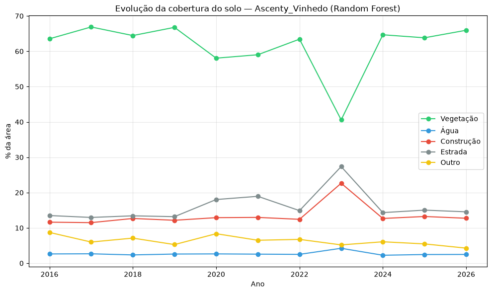
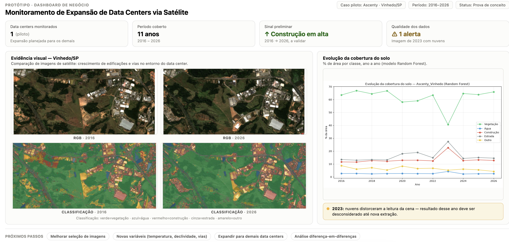
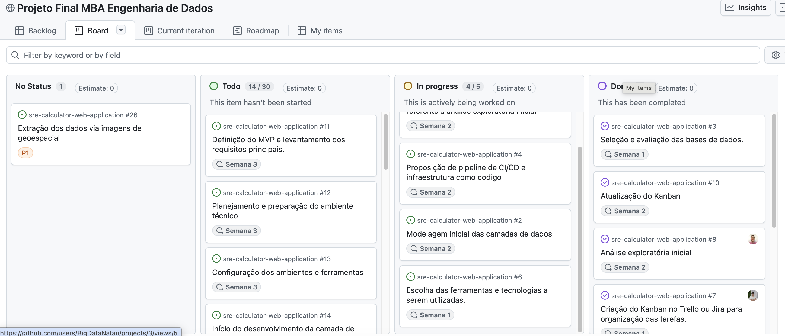

# Sprint 2 — 18/08 a 24/08

!!! warning "Registro histórico"
    Esta página preserva o conteúdo do checkpoint em seu estado original. Decisões de arquitetura vigentes estão na [documentação atual](../arquitetura/index.md).

## Sprint 2

**Disciplina: Hands-On Fundamentos de Dados e Analytics**
Módulo 1 – MBA em Engenharia de Dados – Universidade Presbiteriana Mackenzie
**Mentoria: **Prof. Gustavo Ferreira

## 1. Identificação do grupo

**Nome do Projeto: Sentinela Verde**
**Setor de Atuação: **Setor Público / Meio Ambiente
**Integrantes:**
- Fabio Olivetto Mesquita 10747149
- Fernando Sousa Silva 10739880
- Gabriel Barbosa de Souza 10747173
- Guilherme Giovanetti Cuzner 10204618
- Natan Milanez Polly 10747137
- Taimara Liz de Souza 10369003

## 2. Modelagem inicial das camadas de dados 

Para nossa camada de dados, decidimos seguir com uma arquitetura medalhão. Temos a camada Bronze, contendo todos os dados brutos que consumimos (as imagens de satelites, dados de indicadores, dados de relatórios socio-econômicos etc.) e também os dados gerados pelo primeiro modelo com base nas imagens, temos a camada Silver já com os dados mais relacionados e agrupados por visão de negócio mas sem tratamento e transformação nenhuma (apenas limpeza como remoção de espaços a mais, padronização de dados como CNPJ para o mesmo padrão) e a camada Gold possuindo, até o momento, uma OBT consolidando todos os dados ingeridos em uma única tabela para que o modelo estatístico consiga usar todos dados de uma única fonte.

## 3. Proposição de pipelines de CI/CD e infraestrutura como código

Estamos desenvolvendo pipelines de CI/CD centralizados nesse repositório:

Nele automatizaremos: a criação de novos repositórios (com base em templates/modelos), deploy para AWS, armazenamento do .tfstate na nuvem.

## 4. Análise exploratória inicial

[Link Github](https://github.com/Sentinela-Verde/datacenter-extracao-modelos/tree/main)
Na análise exploratória inicial foi realizada a construção e validação das primeiras etapas do pipeline de processamento de imagens de satélite, com o objetivo de verificar a viabilidade da utilização de imagens Sentinel-2 para identificação e acompanhamento da expansão de áreas construídas associadas a data centers.

#### **4.1. Conexão com as APIs e bibliotecas**

Inicialmente, foram desenvolvidas as funções responsáveis pela conexão com a API do **Google Earth Engine**, utilizando a biblioteca **`ee`**, além das bibliotecas necessárias para processamento e análise dos dados, como **`geemap`**, **`rasterio`**, **`numpy`**, **`matplotlib`**, **`osmnx`** e bibliotecas de aprendizado de máquina como **`scikit-learn`** e **`TensorFlow`**.
Essa etapa permitiu estruturar as funções de forma reutilizável, possibilitando posteriormente executar o mesmo pipeline para diferentes data centers.

#### **4.2. Seleção do data center para teste**

Como primeiro caso de uso, foi selecionado o **data center da Ascenty localizado em Vinhedo/SP**. A escolha teve como objetivo testar o pipeline completo em uma área conhecida antes de expandir o processamento para os demais data centers.
Foram utilizadas as coordenadas geográficas do empreendimento como ponto central para definição da área de interesse, considerando um buffer de aproximadamente 3 km ao redor do local.

	

	

#### **4.3. Extração das imagens Sentinel-2**

Na etapa seguinte, foram desenvolvidas funções para realizar o download das imagens de satélite por meio do Google Earth Engine.
Foram extraídas imagens para o período de **2016 a 2026**, considerando uma janela temporal entre maio e julho de cada ano e aplicando filtros para redução da presença de nuvens.
As imagens foram armazenadas no formato **GeoTIFF (TIF)**, contendo as bandas espectrais:
- B2 — Azul;
- B3 — Verde;
- B4 — Vermelho;
- B8 — Infravermelho próximo (NIR);
- B11 — Infravermelho de ondas curtas (SWIR);
- B12 — Infravermelho de ondas curtas (SWIR).
Também foram geradas composições RGB das imagens para permitir uma inspeção visual inicial da evolução da região ao longo dos anos.

#### **4.4. Criação dos modelos de classificação**

Com as imagens extraídas, foi desenvolvida a segunda etapa do pipeline, responsável pela classificação supervisionada dos pixels.
Foram criados inicialmente dois modelos:
- **Random Forest**, utilizando 300 árvores;
- **Rede Neural Densa**, composta por camadas **`Dense`**, **`Dropout`** e uma camada final **`Softmax`**.
Para o treinamento foram utilizados rótulos derivados do **ESA WorldCover**, complementados com dados de vias provenientes do **OpenStreetMap**.
As imagens foram classificadas em cinco categorias:

	

	

#### **4.5. Primeiros resultados**

Como resultado inicial, foram geradas imagens contendo a classificação dos pixels sobreposta às imagens RGB, permitindo realizar uma avaliação visual do comportamento dos modelos.
Também foi criada uma estrutura tabular contendo, para cada ano, o percentual de área pertencente a cada uma das cinco classes e sua respectiva área em km².
Essa estrutura possibilitou iniciar a análise da evolução temporal da cobertura do solo e, principalmente, acompanhar a variação da classe **Construção** entre 2016 e 2026.

#### **4.6. Identificação de gaps e próximos passos**

Durante a análise dos primeiros resultados foram identificados alguns pontos de atenção. Um dos principais problemas ocorreu no ano de **2023**, cuja imagem apresentou uma quantidade elevada de nuvens. Essa condição afetou a qualidade das informações disponíveis e provocou grandes variações na classificação em relação aos anos anteriores e posteriores.
Esse resultado evidenciou a necessidade de aprimorar o processo de seleção e composição das imagens, além de realizar uma análise mais criteriosa da qualidade dos dados antes da classificação.
Como próximos passos, estão previstas melhorias na seleção das imagens, inclusão de novas variáveis espaciais e ambientais, como **temperatura da superfície, a**lém de incorporados índices espectrais como NDVI, NDWI, NDBI, EVI, SAVI, BSI, MNDWI, IBI e NDMI.
No desenvolvimento do projeto também temos como objetivo, melhorar os modelos.
Posteriormente, pretende-se consolidar essas informações em uma base temporal única e aplicar uma abordagem de **diferença-em-diferenças**, permitindo avançar da análise descritiva e criação de um modelo para medir indices de variação ao implementar um novo data center em determinada região.

## Protótipo do dashboard ou dos gráficos referente a análise exploratória inicial

## Kanban

- [Link Kanban](https://github.com/users/BigDataNatan/projects/3/views/2)

