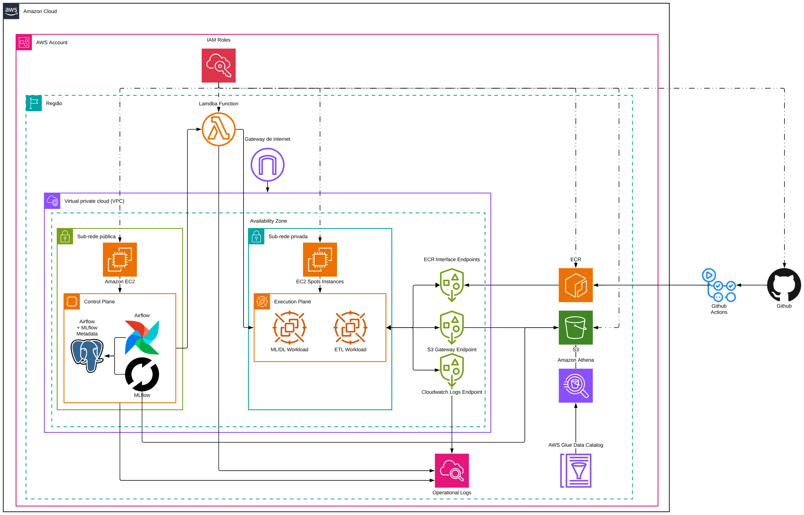

# Sprint 3 — 25/08 a 31/08

!!! warning "Registro histórico"
    Esta página preserva o conteúdo do checkpoint em seu estado original. Decisões de arquitetura vigentes estão na [documentação atual](../arquitetura/index.md).

**Sprint 3 (25/08 – 31/08)**

## 1. Identificação do grupo

**Nome do Projeto: Sentinela Verde**
**Setor de Atuação: **Setor Público / Meio Ambiente
**Integrantes:**
- Fabio Olivetto Mesquita 10747149
- Fernando Sousa Silva 10739880
- Gabriel Barbosa de Souza 10747173
- Guilherme Giovanetti Cuzner 10204618
- Natan Milanez Polly 10747137
- Taimara Liz de Souza 10369003

## 2. Definição do MVP e levantamento dos requisitos principais

- **Objetivo do MVP:** Desenvolver um modelo de Machine Learning e um Dashboard Analytics para prever a transformação socioambiental da instalação de novos datacenters.
- **Escopo de Saída:** Transformações dos índices como de cobertura vegetal, corpos d'água, áreas construídas e malha viária. Caso seja implementado um datacenter na região
- **Requisitos Funcionais:** Pipeline automatizado para leitura de coordenadas geográficas (latitude/longitude), extração de séries temporais de imagens de satélite (2016–2026), integração de dados demográficos do IBGE e características técnicas do projeto (capacidade em MW e tamanho do lote).
- **Requisitos Não-Funcionais:** Arquitetura focada em dados tabulares para mitigar limitações de amostra pequena (20 datacenters históricos), utilizando validação cruzada robusta (Leave-One-Out por datacenter) para evitar overfitting.

## 3. Planejamento e preparação do ambiente técnico

**Para modelagem:**
- **Stack Tecnológica:** Python como linguagem principal para processamento geoespacial e modelagem preditiva.
- **Bibliotecas Geoespaciais:** `Geopandas`, `Rasterio`, `Shapely` e Google Earth Engine API para manipulação dos recortes e extração de métricas de uso do solo.
- **Bibliotecas de Modelagem:** `Scikit-Learn` (Random Forest Regressor) para regressão de múltiplas saídas e `Statsmodels` para análise de causalidade (Controle Sintético / Difference-in-Differences).
- **Stack do Dashboard:** `Streamlit` ou `Dash` integrados com `Plotly` para visualização interativa dos mapas de transformações e curvas preditivas.
**Para infra:**
<mention-user url="user://04e420a3-09ba-4d2e-a593-75a876cd9207"/> 

## 4. Configuração dos ambientes e ferramentas

<mention-user url="user://04e420a3-09ba-4d2e-a593-75a876cd9207"/> 
Repositorio de CI/CD:[https://github.com/Sentinela-Verde/automacao-cicd](https://github.com/Sentinela-Verde/automacao-cicd)
Repositorio Modulos Terraform: [https://github.com/Sentinela-Verde/modulos-terraform](https://github.com/Sentinela-Verde/modulos-terraform)
Estamos utilizando o github actions para os pipelines de CI/CD, centralizando eles em um único repositorio para garantir que todos os repositorios estão executando o mesmo pipeline. 
Utilizamos o terraform para provisionar os recursos na AWS, utilizando um repositorio centralizado de módulos garantindo que todos os recursos subam com a mesma configuração mínima e padronizada.
Na AWS estamos usando a seguinte stack de serviços (Diagrama contendo o uso deles abaixo):
Amazon S3, Amazon Cloudwatch, Amazon Athena, AWS Glue Data Catalog, Amazon EC2, Amazon ECR, AWS Lambda, Amazon Gateway, AWS VPC.

## 5. Início do desenvolvimento da camada de dados

- **Coleta e Delimitação:** Mapeamento de 20 datacenters históricos com extração de recortes concêntricos (raio de 2km para transformações diretas e 10km para transformações macro).
- **Engenharia de Features:**
- Séries temporais anuais (2016–2026) com percentuais de solo extraídos via classificação de imagens.
- Integração de taxas de crescimento populacional do IBGE e variáveis exógenas (como % de área plana edificável).
- Inclusão de dados estruturais dos datacenters (potência em MW e área do lote).
- **Grupo de Controle:** Coleta de áreas de controle em cidades com perfil socioeconômico semelhante sem a presença de datacenters para isolamento causal.

## 6. Modelagem Preditiva ou Classificatória

- **Modelo classificação de imagem:** [datacenter-extracao-modelos/notebooks/step2_classificacao_imagens.ipynb at modelo-teste-tai · Sentinela-Verde/datacenter-extracao-modelos](https://github.com/Sentinela-Verde/datacenter-extracao-modelos/blob/modelo-teste-tai/notebooks/step2_classificacao_imagens.ipynb)
- Modelo transformações: Em desenvolvimento
