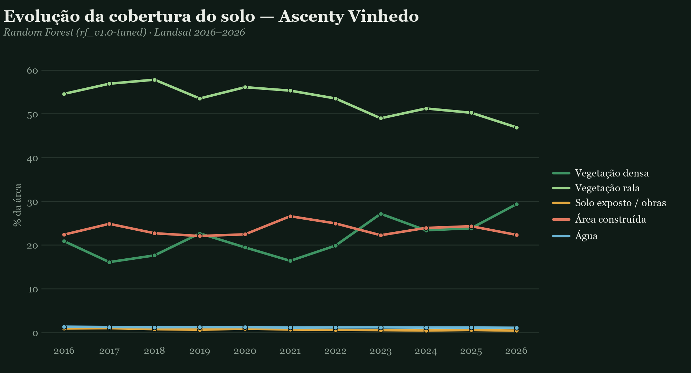

# Sprint 5 — 08/09 a 14/09

!!! warning "Registro histórico"
    Esta página preserva o conteúdo do checkpoint e sua consolidação final até 17/09. Decisões de arquitetura vigentes estão na [documentação atual](../arquitetura/index.md).

## Consolidação final até 17/09

## 1. Revisão geral do escopo

Na última sprint revisamos o escopo completo do projeto e consolidamos as diferentes frentes em um fluxo único e reproduzível.

Na Engenharia de Dados, reorganizamos o pipeline de ponta a ponta, desde a coleta das localizações dos data centers até a extração das imagens, geração dos índices espectrais, classificação de cobertura do solo, temperatura de superfície, seleção dos grupos de controle e consolidação dos indicadores.

Também revisamos dados utilizados nas etapas anteriores. As coordenadas e os endereços dos data centers foram corrigidos e validados novamente, e o pipeline passou a registrar de forma mais clara a proveniência dos arquivos e das transformações realizadas.

Na Ciência de Dados, o modelo de classificação foi retreinado e validado novamente, utilizando Dynamic World como uma das principais fontes de referência para os rótulos. Também foram realizadas análises de robustez, revisão dos pares tratamento-controle e expansão da amostra.

Ao final dessa etapa, a base complementar passou a contar com **31 data centers de tratamento e 31 respectivos controles**, considerando casos do Brasil e dos Estados Unidos.

Após o fechamento da sprint, continuamos os ajustes necessários para transformar o pipeline científico em workloads executáveis na arquitetura proposta.

O workload de classificação de cobertura foi ajustado para:
- calcular os sete índices espectrais quando eles não estivessem presentes no raster de entrada;
- retomar corretamente execuções interrompidas ou que permaneceram em estado `RUNNING`;
- melhorar a identificação e o registro dos erros de execução;
- utilizar os recursos de CPU de forma mais eficiente durante a inferência.

Também avançamos na produtização dos ETLs. O `etl-map-datacenters` recebeu infraestrutura própria, imagem Docker publicada no ECR e um workflow no MWAA Serverless para execução do workload.

A arquitetura final passou a seguir o princípio de **computação efêmera e persistência externa**: o MWAA Serverless orquestra os workloads, instâncias EC2 Spot são criadas somente durante o processamento e os dados, artefatos e logs permanecem fora dessas instâncias.

## 2. Finalização e revisão da documentação

Durante essa etapa realizamos uma revisão geral da documentação técnica e dos repositórios.

O pipeline principal foi reorganizado para deixar explícitas as etapas de coleta, processamento, modelagem e análise, além das dependências entre elas. Foram incluídos manifests de proveniência das imagens, relatórios de conferência e documentação das entradas e saídas de cada etapa.

Também formalizamos os repositórios específicos de governança e do Lakehouse, separando as responsabilidades entre:
- contratos e governança de dados;
- infraestrutura do Lakehouse;
- infraestrutura compartilhada da plataforma;
- ETLs;
- workloads de modelos;
- produtos analíticos.

A arquitetura de dados também foi consolidada em três camadas:
- **Bronze:** dados orientados à fonte, mantendo sua identidade e proveniência;
- **Silver:** dados tratados e canônicos, features reutilizáveis e saídas técnicas dos modelos;
- **Gold:** indicadores, regras de negócio, análises estatísticas e produtos destinados ao consumo.

Para os dados tabulares governados, a arquitetura passou a utilizar tabelas **Apache Iceberg sobre arquivos Parquet**, armazenadas no Amazon S3 e catalogadas pelo AWS Glue Data Catalog.

Os diagramas de arquitetura também foram revisados para representar três perspectivas complementares:
1. **Arquitetura conceitual:** fontes → Bronze → Silver → Gold → consumo;
2. **Arquitetura AWS:** GitHub/GitHub Actions → ECR → MWAA Serverless → EC2 Spot → Lakehouse e serviços gerenciados;
3. **Ciclo de vida das aplicações:** publicação, execução efêmera, persistência, observabilidade e encerramento do workload.

Nos últimos dias antes da apresentação, a documentação final foi reorganizada e revisada para manter consistência entre arquitetura, governança, implementação e resultados.

Também criamos o repositório `projeto-docs`, convertendo a documentação final do projeto para um site estático e publicando esse material utilizando **GitHub Pages**.

## 3. Criação da apresentação final

A apresentação final foi estruturada para contar a história do projeto desde o problema de negócio até os resultados obtidos.

Começamos apresentando o crescimento dos data centers e a dificuldade de mensurar as transformações ambientais e territoriais associadas à implantação dessas instalações.

Em seguida, mostramos como uma imagem de satélite se transforma em dado estruturado. Explicamos as bandas espectrais utilizadas, os sete índices derivados e como cada pixel passa a ser representado por um vetor de características.

A partir desses dados, apresentamos o modelo **Random Forest**, responsável pela classificação da cobertura do solo nas classes:
- vegetação densa;
- vegetação rala;
- solo exposto / obras;
- área construída;
- água.

Depois mostramos a evolução temporal de um data center real e a criação do grupo de controle. Para isso, utilizamos similaridade socioeconômica e territorial para encontrar uma região comparável sem a implantação de um data center.

A métrica principal da análise passou a ser apresentada como:

`efeito líquido = Δ tratamento − Δ controle`

Dessa forma, não analisamos apenas quanto a região do data center mudou, mas quanto ela mudou além da tendência observada na região utilizada como controle.

A apresentação também mostra a expansão da amostra para **31 data centers e seus respectivos pares**, os resultados consolidados da análise e as limitações encontradas ao longo do estudo.

### Referência visual — evolução temporal

*Exemplo de evolução temporal utilizado para comunicar a mudança de cobertura do solo ao longo dos períodos pré-obra, obra e pós-obra.*

Na parte final apresentamos, de forma resumida, a arquitetura implementada, os pipelines de CI/CD e a governança utilizada no projeto.

A arquitetura é apresentada como o mecanismo que permite transformar a metodologia desenvolvida pela equipe em uma solução reproduzível: o código é versionado no GitHub, validado pelos pipelines de CI/CD, empacotado em imagens Docker no ECR e executado de forma efêmera a partir do MWAA Serverless.

Finalizamos mostrando que a análise por imagens de satélite representa apenas uma das dimensões possíveis do problema. Como evolução futura, destacamos temas que não são observados diretamente pelo satélite, como consumo de água, consumo de energia e ruído operacional.

Durante os dias 15, 16 e 17/09, a apresentação passou por ajustes finais de narrativa, simplificação dos slides e revisão dos resultados para adequar todo o conteúdo ao limite de aproximadamente 15 minutos da apresentação.

## Referências visuais e relacionadas

*Arquitetura AWS consolidada utilizada na documentação final do projeto.*

- [Arquitetura atual](../arquitetura/index.md)
- [Sprint 5 publicada no GitHub Pages](https://sentinela-verde.github.io/projeto-docs/entregaveis/sprint-5/)
- [Fonte Markdown da Sprint 5](https://github.com/Sentinela-Verde/projeto-docs/blob/main/docs/entregaveis/sprint-5.md)
- [Documentação completa no GitHub Pages](https://sentinela-verde.github.io/projeto-docs/)
- [Repositório `pipeline-dados`](https://github.com/Sentinela-Verde/pipeline-dados) — implementação científica integrada e base da metodologia final.
- [Repositório `modelo-imagens-satelite`](https://github.com/Sentinela-Verde/modelo-imagens-satelite) — experimentos, validações e evolução da modelagem geoespacial.
- [Repositório `projeto-docs`](https://github.com/Sentinela-Verde/projeto-docs) — fonte da documentação pública.
- [Lucid — Arquitetura AWS](https://lucid.app/lucidchart/dcfc98c9-24cd-4f84-9ea1-5b53f141a5f1/edit)
- [Lucid — Arquitetura de Engenharia de Dados](https://lucid.app/lucidchart/d8f69c0c-1a9f-4b8c-b99d-56c7ca8f35a3/edit)
- [Lucid — Ciclo de Vida das Aplicações](https://lucid.app/lucidchart/4d3ccf8c-38b7-4a9a-a9f8-412432af2207/edit)