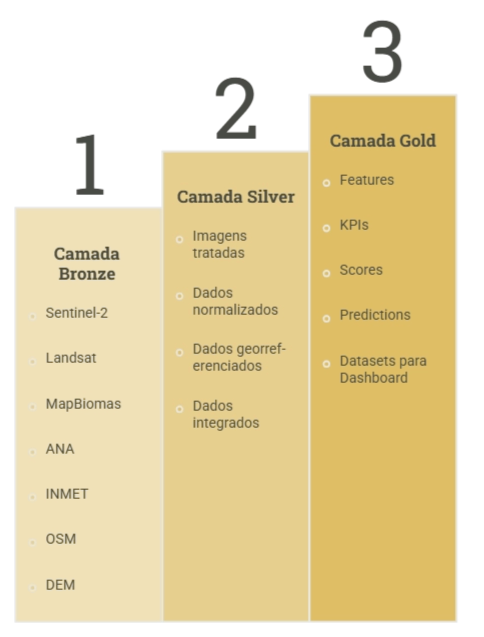
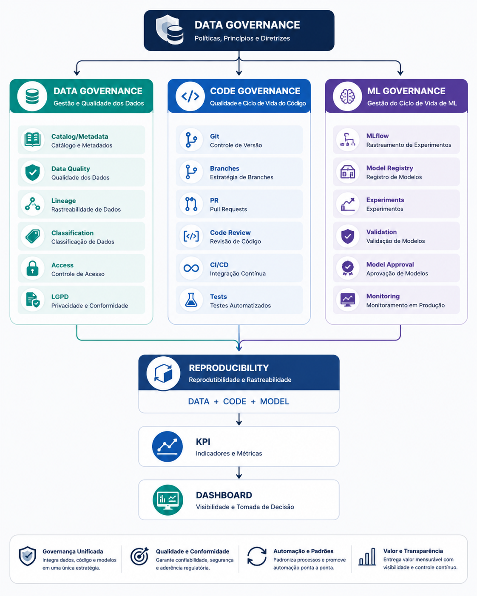

# Governança — Histórico de Revisões

!!! warning "Registro histórico"
    Esta página preserva o conteúdo do checkpoint em seu estado original. Decisões de arquitetura vigentes estão na [documentação atual](../arquitetura/index.md).

**Princípio de governança**
> "Nenhum resultado analítico deve ser considerado oficial se não for possível reproduzi-lo a partir da combinação entre versão do código, versão dos dados, versão das features e versão do modelo."

### 1. Princípios gerais de Governança DAMA

| Princípio | Aplicação no produto |
| --- | --- |
| **Data is an Asset** | Dados geoespaciais são ativos corporativos e devem possuir proprietário, qualidade e ciclo de vida definidos. |
| **Data is Shared** | Dados devem ser disponibilizados por meio de camadas e interfaces controladas, evitando cópias independentes. |
| **Data is Governed** | Todo dataset deve possuir regras de acesso, qualidade, classificação e retenção. |
| **Data Quality** | Nenhuma análise/ML deve consumir dados sem avaliação mínima de qualidade. |
| **Metadata** | Toda informação precisa ter origem, período, resolução, versão, licença e responsável registrados. |
| **Security by Design** | A segurança deve ser definida antes da disponibilização do dado. |
| **Traceability** | Deve ser possível rastrear o resultado do KPI/ML até a fonte original. |
| **Purpose Limitation** | Dados devem ser utilizados para finalidades previamente definidas. |
| **Least Privilege** | Usuários e serviços recebem apenas os acessos necessários. |
| **Accountability** | Toda decisão sobre dados deve possuir responsável definido. |

### **2. Catálogo de Dados**



| **Identificação** | **Origem** |
| --- | --- |
| ·      Dataset ID | ·      Fonte |
| ·      Nome | ·      Sistema/API |
| ·      Descrição | ·      Provedor |
| ·      Domínio | ·      URL/origem |
| ·      Owner | ·      Data de aquisição |
| ·      Steward | ·      Data de atualização |
| — | — |
| **Características geoespaciais** | **Governança** |
| ·      CRS/Sistema de coordenadas | ·      classificação de sensibilidade |
| ·      resolução espacial | ·      política de acesso |
| ·      resolução temporal | ·      retenção |
| ·      cobertura geográfica | ·      licença de uso |
| ·      bounding box | ·      restrições |
| ·      tipo de geometria | ·      qualidade |
| ·      unidade de medida | ·      status do dataset |

### 3. Bronze, Silver e Gold

## 🥉 Bronze — Raw

**Princípio DAMA: preservar a fonte original **
**Owner:** Data Engineer / Data Custodian 
Responsabilidades:
- preservar fonte original;
- não sobrescrever dados;
- registrar data de ingestão;
- registrar origem;
- controlar integridade;
- versionar datasets;
- controlar acesso.
**Regra:** ninguém deve sobrescrever o RAW.
---

## 🥈 Silver — Curated

**Owner:** Data Engineer + Data Steward
Responsabilidades:
- transformação;
- padronização;
- validação;
- qualidade;
- georreferenciamento;
- deduplicação;
- lineage.
**Regra: **Cada transformação precisa ser registrada.
---

## 🥇 Gold — Business/Analytics

**Owner:** Data Owner + Data Steward
Responsabilidades:
- definição dos KPIs;
- regras de negócio;
- aprovação dos indicadores;
- consistência;
- disponibilização para BI.
**Princípio:** Gold não deve ser utilizado como fonte de verdade sem rastreabilidade até Silver/Bronze.
O **Owner **do ML - Machine Learning é o **Data Scientist, **cujas responsabilidades são
- código;
- features;
- treinamento;
- hiperparâmetros;
- avaliação;
- documentação;
- versionamento;
- explicabilidade.

### 4. Qualidade dos dados

| Dimensão | Aplicação |
| --- | --- |
| **Precisão (Accuracy)** | A informação representa corretamente a realidade? |
| **Completude** | Existem dados ausentes? |
| **Consistência** | Dados estão coerentes entre fontes? |
| **Atualidade** | O dado é suficientemente recente? |
| **Conformidade** | Formato, unidade, CRS e regras estão corretos? |
| **Disponibilidade** | O dataset está acessível quando necessário? |
| **Proveniência/linhagem (Lineage)** | Origem do cálculo do indicador |

### 5. Data Quality Score

| Dimensão | Peso | Resultado |
| --- | --- | --- |
| Precisão | 25% | 95 |
| Completude | 15% | 98 |
| Consistência | 15% | 97 |
| Atualidade | 15% | 90 |
| Conformidade | 15% | 100 |
| Disponibilidade | 15% | 99 |
| **Score** | **100%** | **96,4** |

**Regra: **Dataset com DQ Score \< 80 não pode alimentar o modelo de produção sem aprovação do Data Steward

### 6. Qualidade específica para imagens

**Image Quality Score**
Considerar:
- cobertura de nuvens;
- resolução espacial;
- resolução temporal;
- qualidade radiométrica;
- qualidade geométrica;
- presença de sombras;
- percentual de pixels inválidos;
- diferença temporal entre imagens;
- cobertura da área de interesse.
Exemplo:
```text
Sentinel-2
Área: Data Center X

Cloud coverage: 4%
Spatial resolution: 10m
Valid pixels: 98%
Geometric quality: OK
Temporal gap: 14 days

Image Quality Score = 96/100
```
Isso evita alimentar o ML com uma imagem ruim e depois atribuir o erro ao algoritmo.

### 7. Papéis e  responsabilidades

- **Data Owner **→ Responsável pelo **"o quê e para quê"**.
- **Data Steward  **→ Responsável pelo **"como manter o dado confiável"**
- **Data Custodian **→ Responsável pelo **"como proteger e armazenar"**
- **Data Engineer** → Responsável pela **ingestão, transformação**
- **Data Scientist** → Responsável pelos **modelos, treinamento, validação, métricas**
- **Data Consumer** → Responsáel pelo **dashboard, indicadores, análises, recomendações**
- **Cloud/DevOps **→ Responsável por exemplo por validar se o pipeline está seguro, reproduzível 
- **Security/LGPD **→ Resposnsável por exemplo por validar se existe algum risco de exposição ou tratamento indevido
Modelo de **RACI**, separando claramente responsabilidade de negócio, dados, tecnologia e ML.

| Atividade | Data Owner | Data Steward | Data Engineer | Data Scientist | Cloud/DevOps | Security/LGPD |
| --- | --- | --- | --- | --- | --- | --- |
| Definir finalidade do dado | **A** | C | I | C | I | C |
| Classificação do dado | **A** | **R** | C | C | I | C |
| Definir regras de qualidade | A | **R** | **R** | C | I | C |
| Ingestão dos dados | I | C | **R/A** | I | C | I |
| Catálogo/metadata | A | **R** | R | C | I | I |
| Data lineage | I | **A** | **R** | R | C | I |
| Controle de acesso | I | C | C | I | **R/A** | C |
| LGPD | I | C | C | I | C | **R/A** |
| Desenvolvimento ML | I | C | C | **R/A** | C | I |
| Validação do modelo | A | C | C | **R** | I | C |
| Deploy | I | I | C | R | **R/A** | C |
| Monitoramento | I | C | R | **R** | **A** | I |
| Aprovação de produção | **A** | C | C | C | R | C |

**R = **Responsible**  \| A = **Accountable** \| C = **Consulted** \| I = **Informed** **

### **8. Políticas de acesso**

**Matriz simplificada**

| Camada | Engineer | Data Scientist | BI | Executivo |
| --- | --- | --- | --- | --- |
| Bronze | RW | R | ❌ | ❌ |
| Silver | RW | R | R\* | ❌ |
| Gold | RW | RW | R | R |
| Models | RW | RW | ❌ | ❌ |
| — | — | — | — | — |

`R = Read   |   RW = Read/Write`

### 9. LGPD 

A LGPD se aplica ao tratamento de **dados pessoais**, ou seja, informações relacionadas a pessoa natural identificada ou identificável.

### Dados que provavelmente NÃO são dados pessoais:

- Sentinel-2;
- Landsat;
- NDVI;
- NDWI;
- temperatura superficial;
- elevação;
- rios;
- estradas;
- uso do solo;
- queimadas;
- desmatamento;
- dados ambientais agregados;
- coordenadas de um Data Center.
Portanto, o **núcleo do produto geoespacial não necessariamente contém dados pessoais**.
**Mas havendo dados incoporados, como : **
- dados de colaboradores;
- usuários;
- contatos;
- dados de clientes;
- localização individual;
- logs;
- dados censitários em granularidade que permita identificação;
- informações associadas a imóveis/proprietários identificáveis.
A governança LGPD passa a ser necessária.
**Regra**: O produto deve priorizar dados agregados, anonimizados ou não pessoais. A inclusão de dados pessoais requer avaliação de privacidade antes da ingestão. {color="orange_bg"}

### 10. Classificação de sensibilidade

| **🟢 Público** | 🔵** Interno** |
| --- | --- |
| ·    Landsat | ·  features |
| ·    Sentinel | ·  análises |
| ·    MapBiomas público | ·  datasets intermediários |
| ·    dados ambientais públicos | ·  parâmetros do modelo |

| **🟠 Confidencial** | **🔴 Restrito** |
| --- | --- |
| ·  localização planejada de novo Data Center; | ·  credenciais; |
| ·  capacidade energética; | ·  chaves; |
| ·  estratégia de expansão; | ·  dados pessoais sensíveis; |
| ·  análises de viabilidade; | ·  informações de segurança física; |
| ·  scores de regiões candidatas. | ·  dados críticos de infraestrutura; |
| — | ·  informações estratégicas altamente restritas. |

A classificação da** imagem em si** e **o resultado derivado dela** são separadas.
Por exemplo:
> Sentinel-2 original → **Público**
mas:
> "Análise indica que Região X é a melhor localização para novo Data Center" → **Confidencial**
Ou:
> "Mapa com infraestrutura crítica e localização de subestações" → potencialmente **Restrito/Confidencial**, dependendo do contexto e da fonte.
Isso é importante porque **dados públicos podem gerar informação estratégica quando combinados**.

### 11. Governança do Git

Uma estrutura simples seria:
```text
geospatial-datacenter/
│
├── data_ingestion/
├── data_quality/
├── geospatial_processing/
├── feature_engineering/
├── model/
├── inference/
├── dashboard/
├── tests/
├── config/
├── docs/
├── infrastructure/
│
├── requirements.txt
├── README.md
└── .gitignore
```
---
**Regra: Não versionar os datasets diretamente no Git** {color="orange_bg"}
Não fazer:
```text
Git
 └── Sentinel-2/
      └── imagens gigantes
```
O Git deve armazenar:
- código;
- configuração;
- schemas;
- regras;
- documentação;
- notebooks controlados;
- testes;
- parâmetros.
Os dados ficam no:
**S3**
E o Git guarda a referência:
```text
dataset_id = sentinel2_2026_08
dataset_version = 1.4
s3_location = s3://.../silver/
```
---

### 12. Estratégia de branches {color="yellow_bg"}

Estrutura
```text
main
 │
 ├── develop
 │
 ├── feature/
 ├── bugfix/
 └── hotfix/
```

| **Main** | **Develop** | **Feature** | **BugFix** | **HotFix** |
| --- | --- | --- | --- | --- |
| validado e aprovado para produção/demo oficial | Integração do desenvolvimento | Novas funcionalidades | Correções | Correções críticas da versão publicada |

---
**Regra fundamental: ninguém faz commit direto em** **`main.`****main é protegida e somente pode receber código através de Pull Request aprovado.** {color="orange_bg"}
Fluxo:
```text
Developer
   ↓
feature/xxx
   ↓
commit
   ↓
Pull Request
   ↓
Automated Tests
   ↓
Code Review
   ↓
Data/ML Validation
   ↓
Merge
   ↓
develop
   ↓
Release
   ↓
main
```
---

### 13. Pull Request obrigatório

Cada PR deveria responder:
**Checklist**
- [ ] código revisado;
- [ ] testes executados;
- [ ] documentação atualizada;
- [ ] impacto nos dados avaliado;
- [ ] impacto nos KPIs avaliado;
- [ ] segurança avaliada;
- [ ] modelo validado, quando aplicável;
- [ ] lineage atualizado;
- [ ] versão definida.
Isso cria uma **trilha de auditoria**.
---
**Padrão de commits - ** **Conventional Commits**
Exemplos:
```text
feat: adiciona ingestão Sentinel-2
feat: adiciona cálculo NDVI
feat: adiciona modelo de suitability
fix: corrige filtro de nuvens
fix: corrige transformação de CRS
refactor: reorganiza pipeline geoespacial
test: adiciona testes para NDVI
docs: atualiza documentação do modelo
chore: atualiza dependências
```
Isso facilita entender a evolução do produto.
---
**Versionamento semântico**
MAJOR.MINOR.PATCH
Exemplo:
```text
v1.0.0
```

| **                         MAJOR ****(**Mudança que quebra compatibilidade) | **                       MINOR**(Nova funcionalidade compatível) | **            PATCH**          (correção) |
| --- | --- | --- |
| v1.0.0 → v2.0.0 | v1.0.0 → v1.1.0 | v1.1.0 → v1.1.1 |
| Exemplo: | Exemplo: | Exemplo: |
| ·    mudança completa do modelo; | ·     novo indicado | • correção de bug |
| ·    mudança de estrutura do dataset; | ·     nova fonte | • ajuste de cálculo |
| ·    alteração incompatível da API. | ·     novo algoritmo | • correção de documentação |
| — | ·     nova feature | • correção de bug |

---
**Particularidade: código ≠ dados ≠ modelo**
Utilização de 3 versionamentos independentes.

| **                        CÓDIGO** | **                      DATAESET** | **                   MODELO** |
| --- | --- | --- |
| Git→ v1.4.2 | DataSet→ sentinel2_v2026.08 | Model→ suitability_model_v1.3 |

E o resultado precisa registrar os três.
Por exemplo:
```text
Prediction ID: P000123

Code:
v1.4.2

Dataset:
geospatial_features_v2.1

Model:
suitability_model_v1.3

Features:
feature_set_v2.0

Execution:
2026-08-24 15:32

Score:
82.4
```
Isso é **model/data lineage na prática**.
---
**Regra de versionamento do modelo**

| **               MODELO EXPERIMENTAL** | **                MODELO VALIDADO** | **        MODELO EM PRODUÇÃO** |
| --- | --- | --- |
| model-dev-001 | suitability-v1.0 | suitability-v1.0-prod |

Quando mudar:
```text
suitability-v1.1
```
O modelo anterior **não deve ser apagado**.
Deve permanecer disponível para:
- auditoria;
- comparação;
- rollback;
- reprodução de resultados.

### 14.Critérios para promover modelo para produção {color="yellow_bg"}

 **Model Quality Gate **

| Critério | Mínimo |
| --- | --- |
| Accuracy | ≥ 85% |
| Precision | ≥ 80% |
| Recall | ≥ 80% |
| F1 | ≥ 85% |
| Dados completos | ≥ 95% |
| Missing features | \< 5% |
| Drift | dentro do limite |
| Explicabilidade | obrigatória |
| Aprovação Data Scientist | Sim |
| Aprovação Data Owner | Sim |

---

### 15. CI/CD

O Git também deve controlar o pipeline de CI/CD.
Exemplo:
```text
Git Push
   ↓
GitHub Actions
   ↓
Lint
   ↓
Unit Tests
   ↓
Data Quality Tests
   ↓
Security Scan
   ↓
Build
   ↓
Model Validation
   ↓
Deploy
```
Se algum teste falhar:
```text
❌ Pipeline bloqueado
```
Isso evita que código inconsistente chegue ao ambiente de produção.
---

### 16. Regras específicas para o projeto geoespacial {color="yellow_bg"}

**Regra 1 — nenhuma imagem sem metadata**
Toda imagem deve possuir:
```text
source
acquisition_date
resolution
CRS
cloud_cover
processing_level
```
**Regra 2 — nenhum modelo sem dataset versionado**
```text
Model v1.0
       ↓
Dataset v2.1
```
**Regra 3 — nenhum KPI sem lineage**
```text
Environmental Score
        ↓
Features
        ↓
Datasets
        ↓
Source
```
**Regra 4 — nenhum modelo em produção sem validação**
PR + teste + validação estatística + aprovação.
**Regra 5 — não sobrescrever artefatos**
Nunca:
```text
model_final.pkl
```
e substituir o arquivo.
Utilizar:
```text
model_v1.0.pkl
model_v1.1.pkl
model_v2.0.pkl
```
---

### 17.Governança específica para Machine Learning

**Model Governance**
Para cada modelo:
```text
Model ID
Model Owner
Training Dataset
Dataset Version
Features
Algorithm
Hyperparameters
Training Date
Validation Dataset
Accuracy
Precision
Recall
F1
Version
Approval Status
```
**Model Lineage**
```text
Data Source
     ↓
Bronze
     ↓
Silver
     ↓
Features
     ↓
ML Model
     ↓
Prediction
     ↓
KPI
     ↓
Dashboard
```
Assim é possível auditar, por exemplo: **"Por que o modelo classificou essa região como Risk Score 82?"**

### 18. Estrutura completa de Governança



- [Governança de Dados — Revisão e Estrutura Final](revisao-estrutura-final.md)

- [Governança — Versão Atualizada](versao-atualizada.md)

- [Governance Manifest for AI Agents — Compact Guardrails](guardrails-agentes.md)
