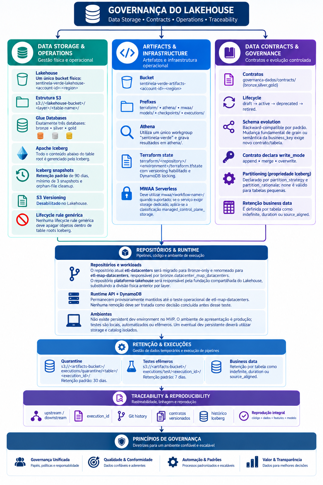

# Governança — Versão Atualizada

!!! warning "Registro histórico"
    Esta página preserva o conteúdo do checkpoint em seu estado original. Decisões de arquitetura vigentes estão na [documentação atual](../arquitetura/index.md).

**Princípio de governança**
> "Nenhum resultado analítico deve ser considerado oficial sem rastreabilidade suficiente para identificar código, dados, transformações e, quando aplicável, modelo utilizados na geração do resultado. A reprodução integral desses componentes constitui objetivo de governança e deve evoluir conforme a implementação técnica do projeto."

## 1. Princípios gerais de Governança DAMA

| Princípio | Aplicação no produto |
| --- | --- |
| **Data is an Asset** | Dados geoespaciais são ativos do projeto e devem possuir proprietário, qualidade e ciclo de vida definidos. |
| **Data is Shared** | Dados devem ser disponibilizados por camadas e interfaces controladas, evitando cópias independentes. |
| **Data is Governed** | Todo dataset governado deve possuir regras de acesso, qualidade, classificação e retenção. |
| **Data Quality** | Análises e ML não devem consumir dados sem avaliação mínima de qualidade. |
| **Metadata** | Toda informação governada deve possuir origem, período, versão, responsável e metadados técnicos aplicáveis. |
| **Security by Design** | A segurança deve ser definida antes da disponibilização do dado. |
| **Traceability** | Deve ser possível rastrear resultados analíticos até seus dados de origem e transformações. |
| **Purpose Limitation** | Dados devem ser utilizados para finalidades previamente definidas. |
| **Least Privilege** | Usuários e serviços recebem apenas os acessos necessários. |
| **Accountability** | Toda decisão sobre dados deve possuir responsável definido. |

## **2. Catálogo de Dados**

O catálogo mantém os elementos originais de identificação, origem, características geoespaciais e governança, complementados pelo contrato técnico versionado.
Para as tabelas governadas do Lakehouse, o AWS Glue DataCatalog utiliza exatamente três databases: `bronze`, `silver` e `gold`.
**Nomenclatura:**
- Bronze: `<source>_<entity>`;
- Silver: `<entity>` ou `<entity>_<concept>`;
- Gold: `<subject>_<analytical_product>`.
Databases, tabelas, colunas e valores categóricos governados utilizam inglês em lowercase `snake_case`.
Cada contrato deve declarar, no mínimo: `table`, `description`, `grain`, `business_key`, `required_columns`, `nullability`, `quality_rules`, `freshness`, `owner`, `upstream`, `downstream`, `contract_version`, `write_mode`, `partition_strategy`, `partition_rationale`, `retention`, `classification` e lifecycle.
Os contratos versionados em YAML no repositório `governanca-dados` são o authoritative source of truth. O Notion permanece como documentação de governança e arquitetura.
A separação de responsabilidades de armazenamento é: Git para código, configuração, contratos, manifests de proveniência e fixtures pequenas/sintéticas; Lakehouse para datasets tabulares governados; bucket de artifacts para modelos, checkpoints, quarantine e outputs temporários de execução; objetos raster pesados podem utilizar storage governado próprio ou prefixo dedicado, referenciado por metadados catalogados.

## 3. Bronze, Silver e Gold

### 🥉 Bronze — Source-Aligned

**Princípio DAMA: preservar a identidade, semântica e proveniência da fonte**
**Owner:** Data Engineer / Data Custodian
Responsabilidades:
- preservar identidade e semântica da fonte;
- registrar ingestão e origem;
- controlar integridade;
- manter rastreabilidade da fonte;
- controlar acesso;
- aplicar somente correções técnicas compatíveis com a fonte.
Quando tecnicamente aplicável, utiliza `ingested_at`, `source_system` e `source_record_id`.
**Regra:** Bronze é `source-faithful` e `source-aligned`. Não recebe harmonização de negócio. Correções são permitidas somente para correção/republicação da fonte, erro de ingestão, duplicidade ou adequação técnica ao contrato.
---

### 🥈 Silver — Curated

**Owner:** Data Engineer + Data Steward
Responsabilidades:
- transformação;
- padronização;
- validação;
- qualidade;
- georreferenciamento;
- deduplicação;
- lineage;
- normalização para o modelo canônico de domínio.
Silver deve declarar `business_key`. Identificadores canônicos seguem `<entity>_id`, são `string` e preferencialmente UUID-based.
Metadados técnicos obrigatórios: `created_at`, `updated_at`, `execution_id`.
O lineage deve distinguir dependências estáticas de contrato (`upstream`/`downstream`) de lineage de execução. Para resultados oficiais, quando aplicável, o registro de execução deve permitir correlacionar `execution_id`, repositório, commit Git, versões de contrato, snapshots de entrada, snapshot de saída e artifact/modelo utilizado.
**Regra:** Cada transformação precisa ser registrada e deve respeitar o contrato versionado.
---

### 🥇 Gold — Business/Analytics

**Owner:** Data Owner + Data Steward
Responsabilidades:
- definição dos KPIs;
- regras de negócio;
- aprovação dos indicadores;
- consistência;
- disponibilização para consumo analítico.
Cada tabela Gold representa um analytical product e deve declarar caso de uso, grain, `business_key`, measures, dimensions, consumidores e freshness. Gold contém datasets analíticos governados; gráficos renderizados, relatórios, imagens e demais artifacts de apresentação permanecem fora da camada Gold e devem manter lineage até o dataset governado correspondente.
Metadados técnicos obrigatórios: `created_at`, `updated_at`, `execution_id`.
**Princípio:** Gold não deve ser utilizada como fonte de verdade sem rastreabilidade até Silver/Bronze.
O **Owner** de Machine Learning é o **Data Scientist**, responsável por código, features, treinamento, hiperparâmetros, avaliação, documentação, versionamento e explicabilidade.

## 4. Qualidade dos dados

As dimensões originais são preservadas: Precisão, Completude, Consistência, Atualidade, Conformidade, Disponibilidade e Proveniência/Lineage.
Cada `quality_rule` deve declarar severidade:
- `critical`: falha o pipeline e impede publicação;
- `error`: envia registros isoláveis para quarantine; se não houver isolamento seguro, falha a escrita;
- `warning`: publicação permitida com registro da ocorrência;
- `info`: observabilidade.
Registros inválidos nunca devem ser descartados silenciosamente.

## 5. Data Quality Score

A regra original permanece válida: dataset com DQ Score \< 80 não pode alimentar modelo de produção sem aprovação do Data Steward.
O DQ Score funciona como controle complementar às `quality_rules`; não substitui validações `critical` ou `error` definidas no contrato. A fórmula, dimensões, pesos e critérios de cálculo do DQ Score devem ser definidos em especificação de qualidade governada e versionada, de modo que o valor seja reproduzível.

## 6. Qualidade específica para imagens

**Image Quality Score**
Preservar os critérios originais: cobertura de nuvens, resolução espacial e temporal, qualidade radiométrica e geométrica, sombras, pixels inválidos, diferença temporal e cobertura da área de interesse.
Para datasets de imagem governados, esses critérios devem ser formalizados em `quality_rules` do contrato correspondente.
Arquivos raster pesados, como GeoTIFF, podem permanecer como objetos imutáveis em storage governado quando Iceberg não for a representação adequada. Nesses casos, metadados, proveniência, cobertura, checksum e referência ao objeto devem ser registrados em tabelas governadas e catalogadas.

## 7. Papéis e responsabilidades

- **Data Owner **→ Responsável pelo **"o quê e para quê"**.
- **Data Steward  **→ Responsável pelo **"como manter o dado confiável"**
- **Data Custodian **→ Responsável pelo **"como proteger e armazenar"**
- **Data Engineer** → Responsável pela **ingestão, transformação**
- **Data Scientist** → Responsável pelos **modelos, treinamento, validação, métricas**
- **Data Consumer** → Responsáel pelo **dashboard, indicadores, análises, recomendações**
- **Cloud/DevOps **→ Responsável por exemplo por validar se o pipeline está seguro, reproduzível 
- **Security/LGPD **→ Resposnsável por exemplo por validar se existe algum risco de exposição ou tratamento indevido
Modelo de **RACI**, separando claramente responsabilidade de negócio, dados, tecnologia e ML.

| Atividade | Data Owner | Data Steward | Data Engineer | Data Scientist | Cloud/DevOps | Security/LGPD |
| --- | --- | --- | --- | --- | --- | --- |
| Definir finalidade do dado | **A** | C | I | C | I | C |
| Classificação do dado | **A** | **R** | C | C | I | C |
| Definir regras de qualidade | A | **R** | **R** | C | I | C |
| Ingestão dos dados | I | C | **R/A** | I | C | I |
| Catálogo/metadata | A | **R** | R | C | I | I |
| Data lineage | I | **A** | **R** | R | C | I |
| Controle de acesso | I | C | C | I | **R/A** | C |
| LGPD | I | C | C | I | C | **R/A** |
| Desenvolvimento ML | I | C | C | **R/A** | C | I |
| Validação do modelo | A | C | C | **R** | I | C |
| Deploy | I | I | C | R | **R/A** | C |
| Monitoramento | I | C | R | **R** | **A** | I |
| Aprovação de produção | **A** | C | C | C | R | C |

**R = **Responsible**  \| A = **Accountable** \| C = **Consulted** \| I = **Informed** **
O modelo RACI permanece como referência organizacional. Nos contratos técnicos, ownership operacional deve declarar:
```yaml
owner:
  repository: <repository-name>
  contact: "Time Plataforma"
```
A existência de ownership técnico por repositório não substitui os papéis de governança DAMA.

## 8. Política de acesso

O princípio de `Least Privilege` permanece válido e passa a ser aplicado por tabela governada.
Regras:
- exatamente um workload writer autoritativo declarado por tabela; a identidade técnica de execução pode variar, mas apenas esse workload é responsável por mutações na tabela;
- readers concedidos explicitamente;
- default: no access;
- IAM de escrita limitado ao table root no S3 e recursos correspondentes no Glue;
- MWAA, Athena, modelos, APIs e humanos não recebem write access implícito.
**Matriz simplificada**

| Camada | Engineer | Data Scientist | BI | Executivo |
| --- | --- | --- | --- | --- |
| Bronze | RW | R | ❌ | ❌ |
| Silver | RW | R | R\* | ❌ |
| Gold | RW | RW | R | R |
| Models | RW | RW | ❌ | ❌ |
| — | — | — | — | — |

`R = Read   |   RW = Read/Write`

## 9. LGPD

A definição e exemplos originais de LGPD permanecem válidos.
O produto prioriza dados agregados, anonimizados ou não pessoais. Dados classificados como `personal` ou `sensitive_personal` exigem finalidade documentada, least privilege e, quando aplicável, masking, tokenization, pseudonymization ou aggregation antes de consumo amplo.

## 10. Classificação de sensibilidade

A classificação passa a ser obrigatória no nível de coluna:
- `public`;
- `internal`;
- `confidential`;
- `personal`;
- `sensitive_personal`.
A tabela herda a classificação mais restritiva entre suas colunas.

| **🟢 Público** | 🔵** Interno** |
| --- | --- |
| ·    Landsat | ·  features |
| ·    Sentinel | ·  análises |
| ·    MapBiomas público | ·  datasets intermediários |
| ·    dados ambientais públicos | ·  parâmetros do modelo |

| **🟠 Confidencial** | **🔴 Restrito** |
| --- | --- |
| ·  localização planejada de novo Data Center; | ·  credenciais; |
| ·  capacidade energética; | ·  chaves; |
| ·  estratégia de expansão; | ·  dados pessoais sensíveis; |
| ·  análises de viabilidade; | ·  informações de segurança física; |
| ·  scores de regiões candidatas. | ·  dados críticos de infraestrutura; |
| — | ·  informações estratégicas altamente restritas. |

Permanece válido o princípio original de que a combinação de dados públicos pode gerar informação estratégica ou confidencial.

## 11. Governança do Git

A estrutura distribuída de repositórios permanece como padrão do projeto.
O repositório `governanca-dados` é responsável por contratos, glossário, políticas, qualidade e lineage. Alterações de contrato devem ocorrer por Pull Request, com CI, reviewer distinto do autor e incremento de `contract_version` quando houver alteração material.
Workload repositories implementam os contratos, mas não os redefinem.
O Git deve armazenar:
- código;
- configuração;
- schemas;
- regras;
- documentação;
- notebooks controlados;
- testes;
- parâmetros.
Os dados ficam no: **S3**

## 12. Estratégia de branches

Cada repositório pode utilizar branches de trabalho e Pull Requests, mas `main` é a branch de integração/deploy dos workflows atualmente implementados. Os pipelines devem refletir o comportamento real do repositório.
Exemplo já implementado em `etl-datacenters`: `push` e `pull_request` direcionados a `main`, com reusable workflow central em `automacao-cicd`.

## 13. Pull Request obrigatório

Cada PR deve manter, quando aplicável, o checklist original:
- [ ] código revisado;
- [ ] testes executados;
- [ ] documentação atualizada;
- [ ] impacto em contratos avaliado;
- [ ] breaking changes documentadas;
- [ ] `contract_version` incrementado quando necessário.
Para alterações em `governanca-dados`, deve existir pelo menos um reviewer diferente do autor.

## 14. Critérios para promover modelo para produção

Os critérios originais permanecem como **governance quality gate**, mas não representam um model registry já implementado.
A promoção de modelos deve considerar qualidade dos dados, métricas do modelo, validação do Data Scientist e aprovações de governança aplicáveis. Como MLflow está fora da arquitetura-alvo, a governança não deve depender de MLflow ou de um registry específico.
Artifacts de modelo, quando existentes, devem ser armazenados em `artifacts/models/`; checkpoints em `artifacts/checkpoints/`.

## 15. CI/CD

O Git permanece responsável pelo controle dos pipelines de CI/CD.
A implementação atual utiliza GitHub Actions, reusable workflows em `automacao-cicd` e autenticação AWS via OIDC. Deploys de infraestrutura são realizados por Terraform.
Para contratos de dados, CI deve validar JSON Schema, campos obrigatórios, nomenclatura, tipos, `business_key`, classificação, `write_mode`, ownership, compatibilidade e versionamento. Falhas devem bloquear o deployment.
Fluxos das Actions
```text
Git Push
   ↓
GitHub Actions
   ↓
Lint
   ↓
Unit Tests
   ↓
Data Quality Tests
   ↓
Security Scan
   ↓
Build
   ↓
Model Validation
   ↓
Deploy
```

## 16. Regras específicas para o projeto geoespacial

Padrões adicionais:
- CRS canônico Silver/Gold: `EPSG:4326` / WGS 84;
- `latitude` e `longitude`: `double`;
- geometrias complexas no MVP: `geometry_wkt` + `geometry_crs`;
- Bronze pode preservar o CRS da fonte;
- unidades devem aparecer nos nomes das medidas, por exemplo `area_m2`, `distance_km`, `power_mw` e `energy_mwh`.
O conjunto `base_dados_datacenters` confirma a existência de metadados de origem e atributos geoespaciais como `id_datacenter`, `latitude`, `longitude`, localização e descrições técnicas, portanto essas regras permanecem aderentes ao domínio atual.

## 17. Governança específica para Machine Learning

A governança de ML permanece como requisito, não como afirmação de que todos os controles já estão implementados.
Para cada modelo, devem ser governados quando aplicável:
- Model ID;
- Model Owner;
- versão do código;
- versão dos dados de entrada;
- features;
- parâmetros e hiperparâmetros;
- métricas de avaliação;
- artifacts/checkpoints;
- explicabilidade;
- lineage até datasets governados.
A solução não pressupõe MLflow. O mecanismo técnico de registry/promoção poderá ser definido futuramente sem alterar esses requisitos de governança.

## 18. Estrutura completa de Governança


