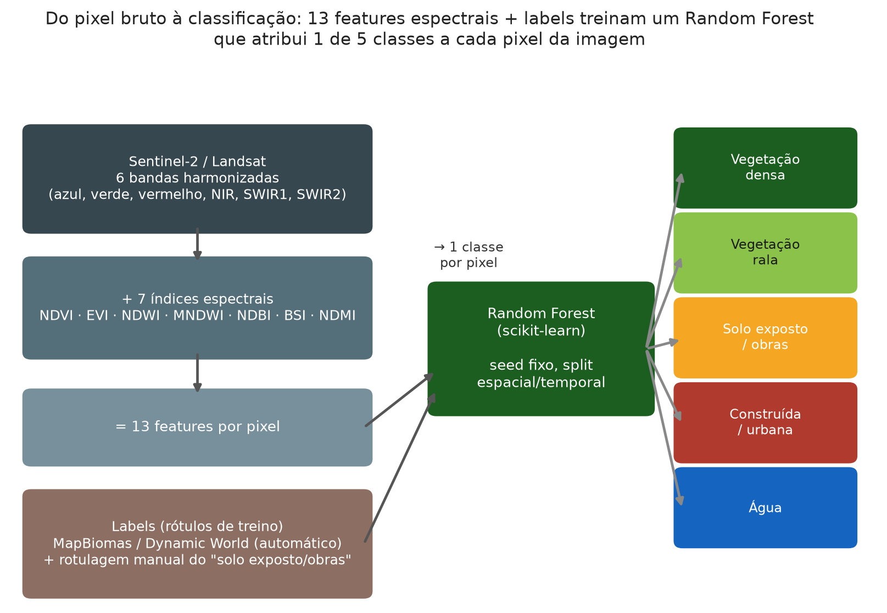
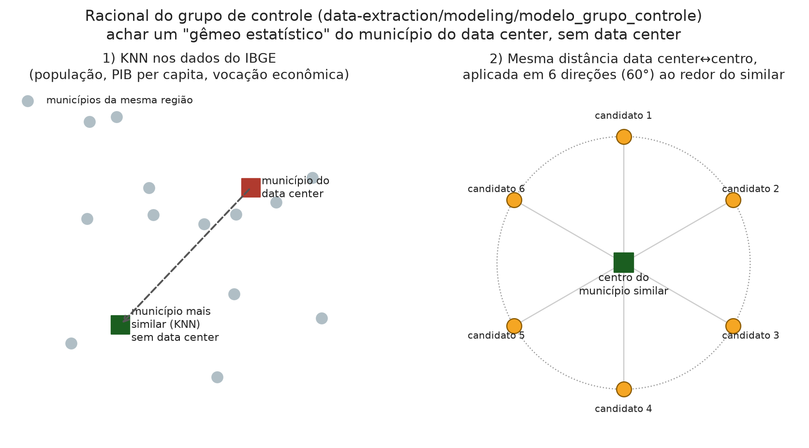
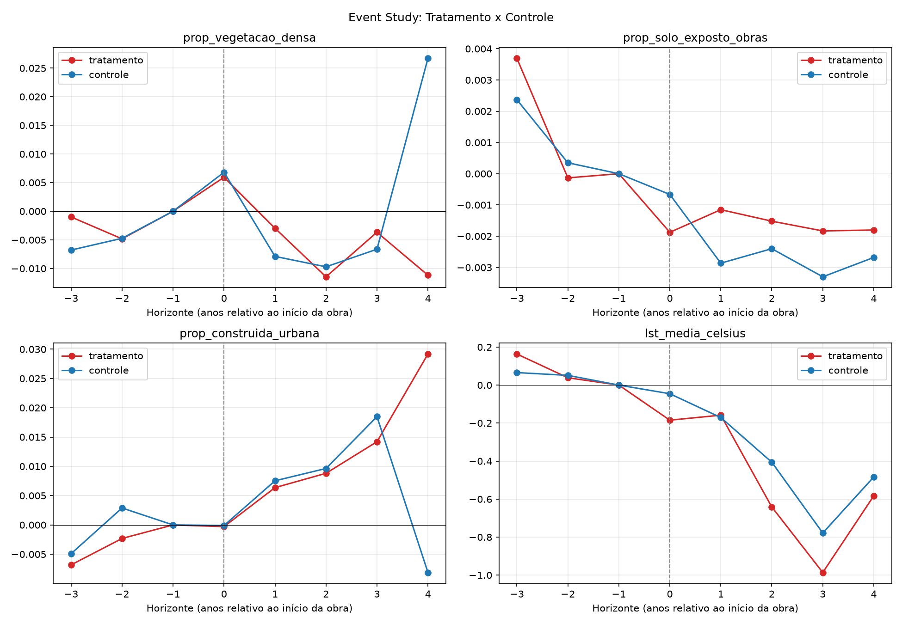
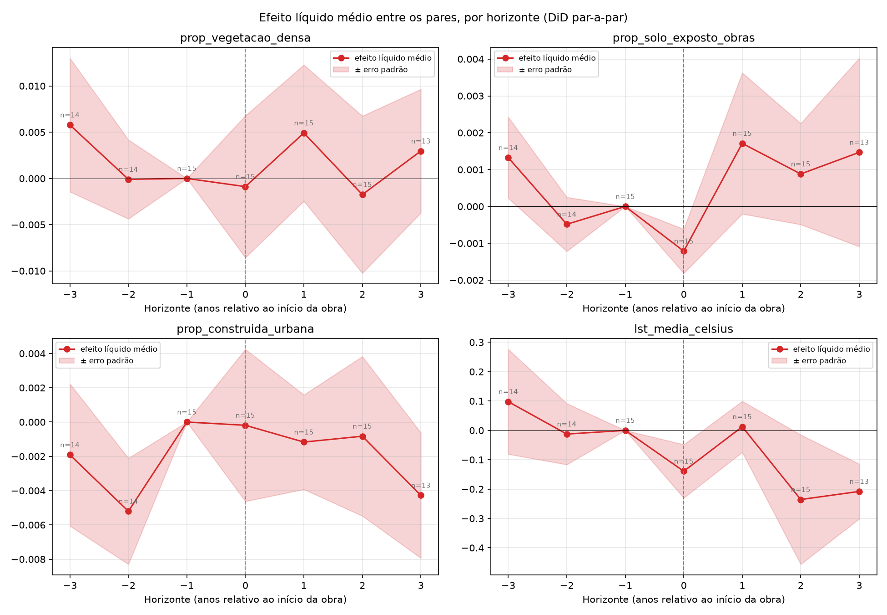
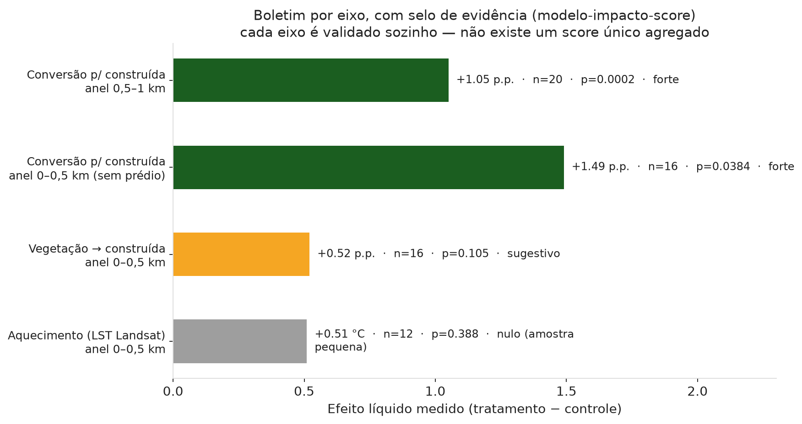

# Sentinela Verde

[Conheça a proposta](proposta.md){ .md-button .md-button--primary } [Explore a arquitetura](arquitetura/index.md){ .md-button }

<div class="grid cards" markdown>

-   :material-target: **Proposta**

    Objetivos, fontes de dados e abordagem do projeto.

    [Acessar a proposta](proposta.md)

-   :material-sitemap: **Arquitetura**

    Plataforma AWS, Lakehouse e ciclo de vida dos workloads.

    [Acessar a arquitetura](arquitetura/index.md)

-   :material-shield-check: **Governança**

    Contratos, qualidade, lineage, segurança e responsabilidades.

    [Acessar a governança](governanca/index.md)

-   :material-package-variant: **Entregáveis**

    Sprints e apresentações preservadas como registros históricos.

    [Acessar os entregáveis](entregaveis/index.md)

</div>

---
## **Introdução**

### **Identificação do grupo**

**Nome do Projeto:** Sentinela Verde — Monitoramento Geoespacial de Data Centers
**Setor de Atuação:** Setor Público / Meio Ambiente
**Integrantes:**
- Fabio Olivetto Mesquita — 10747149
- Fernando Sousa Silva — 10739880
- Gabriel Barbosa de Souza — 10747173
- Guilherme Giovanetti Cuzner — 10204618
- Natan Milanez Polly — 10747137
- Taimara Liz de Souza — 10369003

### **Contexto do projeto**

Os data centers têm se expandido rapidamente no Brasil, em geral próximos a áreas urbanas ou periurbanas. Essas instalações ocupam grandes áreas, podem demandar dezenas de megawatts de potência e promovem alterações no uso do solo em seu entorno. A expansão desses empreendimentos, impulsionada pelo crescimento da computação em nuvem, da inteligência artificial e do volume de dados, pode gerar impactos ambientais e socioeconômicos nas regiões onde são implantados, incluindo riscos relacionados à disponibilidade de recursos, à sustentabilidade, à infraestrutura local e à aceitação social. Nesse contexto, torna-se relevante compreender e mensurar esses impactos para apoiar decisões de localização, planejamento e expansão de forma mais sustentável e responsável.
O Sentinela Verde foi concebido para responder a uma pergunta concreta: **a implantação de um data center altera, de forma mensurável, a cobertura do solo (vegetação, área construída e solo exposto) e a temperatura de superfície em seu entorno, além das mudanças que ocorreriam pela própria tendência regional?** Para responder a essa questão, o projeto combina imagens de satélite, um pipeline de engenharia de dados e métodos de inferência estatística causal, comparando cada data center com uma área de controle semelhante que não recebeu o empreendimento.

### **Frentes de trabalho**

| Frente | Responsabilidade principal | Participação relacionada |
| --- | --- | --- |
| 🛰️ Dados / Geoprocessamento | Fontes geoespaciais, área de estudo, preparação e validação espacial | Features / Ciência de Dados |
| 🔧 Engenharia de Dados | Ingestão, organização, processamento, qualidade e disponibilização | Cloud / DataOps |
| ☁️ Cloud / DevOps | Plataforma AWS, infraestrutura, automação, versionamento e execução | Engenharia de Dados |
| 🤖 Ciência de Dados / Modelagem | Features, dataset de modelagem, treinamento, avaliação e classificação | Dados / Geoprocessamento |
| 📊 Indicadores / Análise | Métricas, áreas, percentuais, comparações e análise temporal | Ciência de Dados |
| 📈 Resultados / Documentação | Integração dos resultados, mapas, gráficos, documentação e apresentação | Todas as frentes |

### **Proposta**

#### **Objetivo geral**

Desenvolver um produto de dados para analisar dados geoespaciais, integrado a técnicas de Machine Learning, com o objetivo de identificar e quantificar alterações ambientais e territoriais no entorno de data centers, a partir da análise comparativa de imagens de satélite anteriores e posteriores à sua instalação, considerando mudanças na cobertura vegetal, nos corpos d'água e na área construída.

#### **Objetivos específicos**

1. **Localizar e qualificar a amostra de estudo:** coletar data centers reais em operação no Brasil, padronizar sua localização e aplicar critérios de elegibilidade para chegar a uma lista de instalações comparáveis entre si.
2. **Construir um grupo de controle:** definir, para cada data center, uma área socioeconomicamente semelhante que não tenha recebido um empreendimento desse tipo, de forma a representar o contrafactual.
3. **Classificar a cobertura do solo por imagem de satélite**, ano a ano, tanto para a área do data center quanto para sua área de controle, usando um classificador supervisionado.
4. **Extrair variáveis complementares** de temperatura de superfície e indicadores socioeconômicos para a mesma área e período.
5. **Consolidar as fontes em um painel único**, estruturado para permitir a comparação entre tratamento e controle.
6. **Testar estatisticamente se o efeito líquido é diferente de zero**, reportando os resultados mesmo quando não houver significância estatística.
7. **Disponibilizar os resultados em um dashboard** que permita explorar o efeito líquido por variável e o histórico de imagens de cada data center e de sua respectiva área de controle.

## Desenvolvimento

### **Stack tecnológica**

| Camada | Tecnologias |
| --- | --- |
| Linguagem e bibliotecas de dados | Python (pandas, NumPy), scikit-learn (Random Forest), rasterio/GDAL (leitura de GeoTIFF) e Matplotlib (visualização) |
| Coleta | Selenium (scraping do datacentermap.com), Google Geocoding API |
| Imagem de satélite | Google Earth Engine (Landsat 8/9, Sentinel-2), MapBiomas Coleção 9, Dynamic World |
| Dados socioeconômicos | Google BigQuery + Base dos Dados (IBGE) |
| Armazenamento e versionamento de dados | Git para código, configuração, contratos e manifests leves; Amazon S3 para dados e artefatos, com separação por finalidade: Lakehouse governado (`bronze`, `silver`, `gold`) para tabelas Apache Iceberg/Parquet; bucket de artifacts para modelos, checkpoints, resultados temporários, Terraform e saídas do Athena; bucket dedicado do MWAA para definições de workflows. Rasters `.tif` permanecem como objetos imutáveis governados quando Iceberg não for a representação adequada, sempre referenciados por metadados, proveniência e checksum. |
| Orquestração e MLOps (arquitetura-alvo) | Amazon MWAA Serverless (Apache Airflow gerenciado), Docker, Amazon ECR, EC2 Spot efêmera, CloudWatch e `servico-runtime` |
| Infraestrutura (arquitetura-alvo) | AWS (S3, EC2/EC2 Spot, Lambda, ECR, Athena, Glue Data Catalog, CloudWatch, VPC), Terraform |
| CI/CD | GitHub Actions, centralizado no repositório `automacao-cicd` |
| Dashboard | Power BI |
| Versionamento de código | GitHub (`Sentinela-Verde`), Conventional Commits e versionamento independente de código, datasets e modelos |

### **Dados utilizados**

#### **Fonte de dados**

| Fonte | O que fornece |
| --- | --- |
| [datacentermap.com](https://www.datacentermap.com/) (scraping) | Lista de data centers e atributos disponíveis na fonte, incluindo localização e, quando presentes, operadora, porte (MW/whitespace), tier e ano operacional. No fluxo governado, somente os atributos admitidos pelo contrato vigente são publicados; campos opcionais da fonte permanecem sujeitos à evolução do contrato em `governanca-dados`. |
| Google Geocoding API | Endereço/município/estado/país/CEP padronizados a partir de lat/lon |
| Google Earth Engine — Landsat 8/9 (30 m) e Sentinel-2 (10 m) | Imagem de satélite (bandas espectrais), 2013–2026 conforme disponibilidade por site |
| Dynamic World / MapBiomas / WorldCover / rotulagem manual | Fontes de referência para rótulos de cobertura do solo e validação do classificador. No pipeline científico atual, Dynamic World e MapBiomas são utilizados conforme a etapa; a arquitetura governada mantém a escolha final de fonte/representação vinculada ao contrato do workload `etl-land-cover-labels`. |
| Rotulagem manual (211 polígonos) | Reforço de rótulo para a classe "solo exposto/obras", pouco representada nas fontes automáticas |
| Base dos Dados / IBGE (BigQuery) | População, PIB, vocação econômica (% VA serviços/indústria/agropecuária) por município e ano |
| Fonte suplementar (EUA) | Base complementar usada apenas na análise exploratória de amostra estendida (ver `03-data-science/`) |

#### **Descrição da base**

A unidade de observação final é **uma área, em um horizonte de tempo específico**: cada data center (área tratada) e sua área de controle pareada geram várias linhas, uma por ano relativo à abertura da obra. O estudo estatístico principal usa uma amostra de **15 pares tratamento/controle no Brasil** (30 áreas). Para chegar a essa amostra:
- 242 data centers foram coletados do datacentermap.com; após o filtro de elegibilidade e a consolidação de facilities do mesmo campus, restaram **21 AOIs** elegíveis.
- Para cada AOI, foram gerados **12 candidatos a grupo de controle** (2 municípios similares × 6 pontos ao redor de cada um), totalizando **252 candidatos** avaliados; o candidato final foi escolhido pela menor distância L1 entre a distribuição de classes de cobertura do solo do candidato e a do próprio data center no período pré-obra.
- Dos 21 pares resultantes, o estudo estatístico oficial usa os **15 que têm imagem e classificação completas** nos dois lados.

#### **Principais variáveis**

| Grupo | Variáveis |
| --- | --- |
| Identificação | `site_id`, `tipo` (tratamento/controle), `pareado_com`, `municipio`, `uf` |
| Horizonte temporal | `ano`, `ano_inicio_obra`, `ano_relativo_ao_inicio_obra`, `fase` (pré/durante/pós) |
| Cobertura do solo (satélite) | `prop_vegetacao_densa`, `prop_vegetacao_rala`, `prop_solo_exposto_obras`, `prop_construida_urbana`, `prop_agua` |
| Clima | `lst_media_celsius` (temperatura de superfície) |
| Socioeconômico | `populacao`, `emprego_formal_total`, `pib_mil_reais`, `numero_empresas` |
| Porte do data center | `mw_construido_total`, `tier`, `n_predios_no_campus`, `whitespace_construido_sqm_total` |
| Qualidade do pareamento | `qualidade_par`, `dist_tratamento_controle_km` |

O alvo analítico é o **efeito líquido**: `delta_tratamento − delta_controle`, onde cada `delta` é a variação da variável em relação ao ano-base (o ano anterior ao início da obra daquela área).

### **Arquitetura**

#### **Fluxo de dados (camadas)**

O pipeline implementado segue nove etapas, encadeadas por camada bronze → silver → gold:
```text
1 Coleta (scraping + geocoding)
   → 2 Extração de imagem (Earth Engine)  ⇉  3 Rótulos (MapBiomas/Dynamic World + manual)
        → 4 Índices espectrais (NDVI, EVI, NDWI, MNDWI, NDBI, BSI, NDMI)
             → 5 Modelo 1: classificação de cobertura do solo (Random Forest)
                  ⇉ 6 Modelo 2: seleção do grupo de controle (KNN + comparação estatística)
                       ⇉ Temperatura de superfície (LST) e socioeconômico (IBGE)
                            → 7 Consolidação (painel único área × ano)
                                 → 8 Análise estatística (event study, DiD, permutação + FDR)
                                      → 9 Reiteração/expansão automática da amostra
```
Cada seta representa uma dependência real do código; ⇉ indica etapas que rodam em paralelo. O diagrama completo está versionado no repositório do pipeline (`pipeline-dados/README.md`).

#### **Arquitetura de execução (AWS) — alvo da plataforma**

> Esta seção descreve a arquitetura de infraestrutura definida para a organização. O repositório `pipeline-dados` representa a implementação científica integrada e reprodutível utilizada para validar a metodologia de ponta a ponta. Em paralelo, a arquitetura de produtização está sendo decomposta em workloads governados por responsabilidade (`etl-*`, `modelo-*` e `produto-*`), executados na AWS com contratos versionados, isolamento de permissões e orquestração própria. Essa transição é deliberada: preserva uma referência integrada e funcional enquanto o pipeline é transformado em componentes operacionais independentes, sem alterar a metodologia já validada.
A arquitetura mantém os componentes de longa duração numa infraestrutura mínima e executa cargas de ETL e ML/DL de forma efêmera, usando EC2 Spot sempre que o workload permitir. O armazenamento persistente é separado por responsabilidade: o Lakehouse em Amazon S3 concentra os dados governados, o bucket de artifacts mantém modelos, checkpoints e artefatos de execução, e o bucket dedicado do MWAA armazena definições de workflows. O estado operacional do `servico-runtime`, enquanto esse componente estiver ativo, permanece em DynamoDB.

| Serviço / tecnologia | Propósito na arquitetura |
| --- | --- |
| AWS IAM | Identidades, funções e permissões (menor privilégio via IAM Roles) |
| AWS Lambda | Automação de operações de infraestrutura de curta duração |
| Amazon VPC + sub-rede privada + VPC Endpoints | Isolamento de rede para workloads em sub-rede privada, sem IP público e sem NAT implícito; acesso a serviços AWS por VPC Endpoints e conectividade externa tratada como dependência explícita |
| Amazon MWAA Serverless | Orquestra ETLs, modelos e produtos analíticos sem exigir uma EC2 persistente de plano de controle |
| EC2 Spot Instances (plano de execução) | ETL e ML/DL efêmeros, sob demanda de cada DAG |
| Amazon ECR | Imagens Docker publicadas pelo CI/CD |
| Amazon S3 | Armazenamento persistente de dados governados no Lakehouse e de objetos/artefatos em buckets dedicados, conforme sua finalidade |
| Amazon Athena + AWS Glue Data Catalog | Consulta SQL sobre os dados do S3 sem cluster analítico dedicado |
| Amazon CloudWatch | Logs e telemetria |
| Amazon VPC Endpoints (S3 Gateway, ECR e CloudWatch Logs Interface) | Acesso privado aos serviços AWS, evitando NAT Gateway |
| Amazon MWAA Serverless (Apache Airflow gerenciado) | Orquestração de ETLs, modelos e produtos analíticos, sem necessidade de servidor persistente de Airflow |
| `servico-runtime`  • Amazon DynamoDB | Controle do estado operacional das execuções enquanto o runtime estiver ativo |
| Bucket de artifacts + metadados versionados | Armazenamento e rastreabilidade de modelos, checkpoints, métricas exportadas e demais artefatos técnicos, sem dependência de MLflow/PostgreSQL na arquitetura-alvo |
| Docker | Empacotamento padronizado de ETLs e workloads de ML/DL |
| GitHub + GitHub Actions | Versionamento e CI/CD (build e publicação das imagens no ECR) |

Princípios de custo e operação: evitar infraestrutura persistente de plano de controle quando um serviço gerenciado atender à necessidade; utilizar MWAA Serverless para orquestração; executar ETLs e workloads de ML/DL em instâncias EC2 Spot efêmeras; padronizar workloads como imagens Docker; utilizar sub-rede privada sem NAT implícito; acessar serviços AWS por VPC Endpoints; aplicar IAM Roles com princípio de menor privilégio; e manter containers reproduzíveis e sem estado local.

### **Camada de dados**

O repositório `pipeline-dados` mantém uma implementação local do data lake estruturada nas três camadas clássicas:
- **Bronze** (`dados/bronze/`) — dados orientados à fonte, preservando identidade, semântica e proveniência. Inclui, por exemplo, JSON de scraping, GeoTIFF de satélite, rótulos anuais e dados socioeconômicos. Cada tabela segue o `write_mode` definido em contrato (`append`, `merge`, `overwrite` ou estratégia idempotente) e possui um único writer autoritativo.
- **Silver** (`dados/silver/`) — dados tratados e canônicos, features reutilizáveis e saídas técnicas de modelos, como classificações, probabilidades, scores, candidatos e atribuições de grupo de controle. Os artefatos binários dos modelos permanecem fora do Lakehouse, no bucket de artifacts.
- **Gold** (`dados/gold/`) — produtos analíticos orientados ao consumo, incluindo regras de negócio, indicadores, métricas finais, visões consolidadas, resultados estatísticos e datasets preparados para dashboards e outras aplicações.
Em paralelo, a arquitetura de plataforma da organização está em implantação progressiva e formaliza a separação de responsabilidades por repositório, writer e camada de Lakehouse no S3. O `pipeline-dados` permanece como referência científica integrada, enquanto os componentes produtivos são migrados de forma controlada para workloads independentes:

| Camada (Lakehouse AWS, alvo da organização) | Conteúdo previsto |
| --- | --- |
| 🥉 Bronze | Dados source-aligned/source-faithful por fonte: DataCenterMap, resultados de geocoding, imagens/raster governados por metadados, rótulos e dados socioeconômicos. Chaves, `write_mode`, particionamento e grain são definidos por contrato; não há PK/FK global fixa baseada em latitude/longitude ou CEP. |
| 🥈 Silver | Entidades canônicas, dados enriquecidos, features reutilizáveis e saídas técnicas de modelos, como classificação de cobertura do solo, probabilidades/scores e seleção/atribuição de grupos de controle. Business keys e grain são definidos no contrato de cada tabela. |
| 🥇 Gold | Produtos analíticos e regras de negócio: visões de impacto ambiental, resultados estatísticos, KPIs, comparações tratamento × controle e datasets finais de consumo para dashboard e análises. Gold não é usada para armazenar saídas técnicas intermediárias de modelos. |

### **Governança**

> **Princípio orientador:** "Nenhum resultado analítico deve ser considerado oficial se não for possível reproduzi-lo a partir da combinação entre versão do código, versão dos dados, versão das features e versão do modelo."

#### **Princípios DAMA**

| Princípio | Aplicação no produto |
| --- | --- |
| Data is an Asset | Dados geoespaciais são ativos com proprietário, qualidade e ciclo de vida definidos |
| Data is Shared | Dados disponibilizados por camada/interface controlada, evitando cópias independentes |
| Data is Governed | Todo dataset tem regras de acesso, qualidade, classificação e retenção |
| Data Quality | Nenhuma análise/ML consome dado sem avaliação mínima de qualidade |
| Metadata | Origem, período, resolução, versão, licença e responsável sempre registrados |
| Security by Design | Segurança definida antes da disponibilização do dado |
| Traceability | Todo KPI/resultado de ML deve ser rastreável até a fonte original |
| Purpose Limitation | Dados usados só para finalidades previamente definidas |
| Least Privilege | Usuários e serviços recebem só os acessos necessários |
| Accountability | Toda decisão sobre dados tem responsável definido |

#### **Responsabilidade por camada**

| Camada | Owner | Responsabilidades |
| --- | --- | --- |
| 🥉 Bronze | Data Engineer / Data Custodian | Preservar fonte original, não sobrescrever, registrar ingestão/origem, versionar, controlar acesso |
| 🥈 Silver | Data Engineer + Data Steward | Transformação, padronização, validação, qualidade, georreferenciamento, deduplicação, lineage |
| 🥇 Gold | Data Owner + Data Steward | Definição de KPIs, regras de negócio, aprovação dos indicadores, consistência, disponibilização para BI |
| ML | Data Scientist | Código, features, treinamento, hiperparâmetros, avaliação, documentação, versionamento, explicabilidade |

**Papéis:** Data Owner ("o quê e para quê") · Data Steward ("como manter confiável") · Data Custodian ("como proteger/armazenar") · Data Engineer (ingestão/transformação) · Data Scientist (modelos/validação) · Data Consumer (dashboard/análises) · Cloud/DevOps (segurança e reprodutibilidade do pipeline) · Security/LGPD (risco de exposição/tratamento indevido) — formalizados numa matriz RACI cobrindo desde a classificação do dado até a aprovação de produção.
**Classificação de sensibilidade:** os dados de satélite/ambientais em si (Landsat, Sentinel-2, MapBiomas) são públicos; passam a confidenciais quando combinados em análises estratégicas (ex.: "esta região é a melhor localização para um novo data center"). O núcleo do produto geoespacial não depende de dado pessoal — a LGPD só entraria em jogo se dados de indivíduos fossem incorporados, o que a governança do projeto recomenda evitar por padrão.
**Qualidade de imagem** (aplicada antes de qualquer classificação): cobertura de nuvens, resolução espacial/temporal, qualidade radiométrica e geométrica, % de pixels válidos — evita atribuir ao modelo um erro que na verdade veio de uma imagem ruim.

### **Definição dos repositórios**

A organização GitHub `Sentinela-Verde` estrutura seus repositórios por **finalidade** (`plataforma`, `automacao`, `modulos`, `governanca`, `ingestao`, `modelo`, `servico`, `produto`) e por **assunto**, de acordo com o domínio tratado. O repositório [`pipeline-dados`](https://github.com/Sentinela-Verde/pipeline-dados) permanece como a implementação científica integrada e reprodutível do fluxo de ponta a ponta, utilizada no desenvolvimento e na validação da metodologia. Para a produtização, a solução é decomposta por responsabilidade e por writer em repositórios independentes `etl-*`, `modelo-*` e `produto-*`, apoiados pelos componentes compartilhados `governanca-dados`, `plataforma-lakehouse`, `plataforma-fundacao`, `automacao-cicd`, `modulos-terraform` e `servico-runtime`. A coexistência dessas estruturas é intencional durante a transição: o pipeline integrado preserva a referência científica validada, enquanto os componentes são promovidos gradualmente para a arquitetura governada na AWS.
Regras fundamentais adotadas nessa organização:
- Dados brutos, credenciais, rasters e artefatos de modelos não são versionados no Git. Arquivos binários de maior volume permanecem no Amazon S3, enquanto o Git mantém apenas os manifests de referência, incluindo `sha256` e localização.
- A branch `main` é protegida e recebe alterações somente por meio de Pull Requests aprovados.
- As mensagens de commit seguem a convenção Conventional Commits (`feat:`, `fix:`, `refactor:`, `test:`, `docs:`).
- O versionamento é tratado em três eixos independentes — código, dataset e modelo —, cada um com sua própria versão, registrada junto aos respectivos resultados.

#### **Repositórios do projeto**

- [`pipeline-dados`](https://github.com/Sentinela-Verde/pipeline-dados) — implementação científica integrada de referência, cobrindo coleta, processamento geoespacial, modelos, consolidação e análise estatística. A arquitetura produtiva correspondente é decomposta progressivamente em workloads `etl-*`, `modelo-*` e `produto-*`. [Desenho pipeline](https://claude.ai/code/artifact/0f4cf670-5e55-4495-bb8b-f0ea743d679f)
- [`automacao-cicd`](https://github.com/Sentinela-Verde/automacao-cicd) — workflows do GitHub Actions centralizados, reaproveitados por todos os repositórios.
- [`modulos-terraform`](https://github.com/Sentinela-Verde/modulos-terraform) — módulos Terraform reutilizáveis, garantindo que todo recurso AWS suba com a mesma configuração mínima e padronizada.

## **Ciência de Dados**

### **Análise exploratória**

#### **Técnicas utilizadas**

- Estatística descritiva: médias de tratamento e controle, percentual de valores nulos e rankings por município.
- **Event study** — evolução do delta (variação em relação ao ano-base) ao longo do horizonte temporal, comparando tratamento e controle.
- **Teste de placebo** — avaliação dos deltas nos períodos anteriores à obra, que devem permanecer próximos de zero. Uma alteração relevante nesse intervalo indicaria que a área já apresentava tendência própria antes da implantação do data center.
- **Diferença-em-diferenças (DiD)** simples — comparação entre as fases pós-obra e pré-obra.
- **Teste de permutação de sinal** — exato para até 20 pares e por Monte Carlo acima desse limite — para avaliar a significância do efeito líquido sem depender da hipótese de normalidade de um teste t em amostras pequenas.
- **Correção por múltiplas comparações (Benjamini-Hochberg / FDR)** — necessária porque testar \~10 variáveis a 5% sem correção infla o risco de falso positivo para quase 40%
- **Intervalo de confiança por bootstrap** (10.000 reamostragens) e **Cohen's d** como tamanho de efeito
- **Mediação física exploratória** (regressão OLS observacional) — testa qual mudança de cobertura do solo mais anda junto do aquecimento de superfície observado
- Matriz de correlação entre variáveis

#### **Ferramentas utilizadas**

Python (pandas, numpy), matplotlib para visualização, relatórios HTML autocontidos gerados pelo próprio pipeline, Google Earth Engine para a extração de imagem, BigQuery/Base dos Dados para o socioeconômico.

#### **Exemplo: evolução de um data center real**


Série de imagens reais (Ascenty Vinhedo) mostrando a mudança de cobertura do solo ao longo dos anos — a mesma lógica aplicada a todos os 15 pares do estudo.

### **Modelagem**

#### **Tipo de problema modelado**

Duas camadas de modelagem, com papéis diferentes:
1. **Classificação de imagem (Modelo 1)** — classificação supervisionada, pixel a pixel, de cobertura do solo em 5 classes (vegetação densa, vegetação rala, solo exposto/obras, área construída, água), a partir de bandas espectrais + 7 índices derivados (NDVI, EVI, NDWI, MNDWI, NDBI, BSI, NDMI).
2. **Inferência causal (efeito líquido)** — não é um modelo preditivo treinado, e sim um conjunto de testes estatísticos (seção anterior) que estima se a diferença tratamento − controle é diferente de zero. Um "Estágio 2" (Random Forest raso para aprender o efeito a partir do porte do data center e da tendência pré-obra, validado com Leave-One-DC-Out) está desenhado e documentado, mas ainda não implementado — a amostra atual (15 pares) é pequena demais para treinar isso com confiança.



#### **Algoritmo(s) utilizados**

- **Random Forest** — classificador de cobertura do solo (Modelo 1) e, no desenho do Estágio 2 (ainda não implementado), o modelo que aprenderia o efeito líquido a partir do porte do data center e contexto regional.
- **KNN (k-vizinhos mais próximos)** — usado no Modelo 2 para achar, para cada município de data center, o município mais parecido (população, PIB per capita, vocação econômica) dentro da mesma região do país, base do grupo de controle.
- **Distância L1** entre distribuições de classe de cobertura do solo — usada para escolher, entre os 12 candidatos gerados por AOI, aquele mais parecido ao próprio data center no período pré-obra.
- **Teste de permutação de sinal + bootstrap** — não é um algoritmo de aprendizado, mas o método estatístico central da camada de inferência causal.


#### **Métricas utilizadas para validação**

- **Classificação de imagem:** este repositório ainda não versiona um relatório formal de acurácia/F1 por classe do classificador de cobertura do solo em produção (`rf_v1.0-tuned`) — o que existe hoje é o manifesto de proveniência do artefato (hash e tamanho do `.joblib`, para garantir que a versão usada em cada execução é a esperada). Registrar essas métricas de validação formalmente é um item em aberto, não uma afirmação de que o modelo não foi avaliado.
- **Inferência causal (o resultado central do projeto):** p-valor (teste de permutação), p-valor corrigido por FDR, intervalo de confiança 95% por bootstrap e Cohen's d, por variável — ver números reais na seção Resultados, abaixo.
- **Seleção de grupo de controle:** distância L1 entre distribuição de classes do candidato e do data center (quanto menor, melhor o pareamento); classificada em qualidade boa/aceitável/ruim.

### **Resultados**

#### **Event study — tratamento × controle**


Evolução do delta (variação em relação ao ano-base) por horizonte de tempo. As duas curvas (tratamento e controle) evoluem de forma parecida antes da obra — o teste de placebo não indica tendência prévia problemática — e passam a divergir depois.

#### **Curva de efeito líquido agregada**

`efeito líquido = delta_tratamento − delta_controle`, agregado (média entre os 15 pares) por horizonte. É a mesma grandeza testada estatisticamente abaixo, aqui de forma descritiva.


#### **Significância estatística — 15 pares (resultado oficial)**

| Variável | Média do efeito líquido | p-valor | p-valor FDR | Significativo (α=0,05) |
| --- | --- | --- | --- | --- |
| População | +43.112 hab. | 0,045 | 0,454 | Não |
| PIB | +R\$ 1,76 bi | 0,658 | 0,943 | Não |
| Área construída | −0,07 p.p. | 0,845 | 0,943 | Não |
| Vegetação densa | +0,08 p.p. | 0,900 | 0,943 | Não |
| Temperatura de superfície | −0,12 °C | 0,294 | 0,943 | Não |
| (demais variáveis) | — | ≥ 0,67 | ≥ 0,94 | Não |

**Com a amostra atual de 15 pares, nenhuma variável apresenta efeito líquido estatisticamente significativo após a correção por múltiplas comparações.** O resultado mais próximo da significância ocorre para a variável **população** e aparece quando o efeito é analisado segundo a fase efetiva da obra, em vez de uma janela temporal fixa para todos os casos. Na fase pós-obra, a população apresenta Cohen's d de magnitude média (0,61), p bruto = 0,006 e p-FDR = 0,176. Embora o resultado ainda não ultrapasse o limiar de 0,05 após a correção, ele representa o indício mais forte observado no painel.

#### **Verificação de robustez: amostra estendida (31 pares Brasil + EUA)**

Uma análise complementar ao estudo oficial avaliou se a ampliação da amostra para 31 pares, combinando os casos do Brasil com uma fonte suplementar de data centers nos Estados Unidos, aumentaria o poder estatístico. Os p-valores diminuem, com destaque para **área construída**, que apresenta p bruto = 0,035 e p-FDR = 0,191 na amostra estendida. Ainda assim, nenhuma variável ultrapassa o limiar de significância após a correção. O resultado indica que o tamanho da amostra e, consequentemente, o poder estatístico constituem uma limitação relevante; por si só, porém, não representam confirmação de efeito. Essa análise é apresentada separadamente do resultado oficial porque incorpora uma fonte de dados dos Estados Unidos que não passou pelo mesmo processo de curadoria aplicado à amostra brasileira.
**Síntese dos resultados:** até o momento, o projeto não encontrou evidência estatisticamente significativa de que a implantação de um data center altere a cobertura do solo, a temperatura de superfície ou os indicadores socioeconômicos do entorno. Entretanto, foram observados dois sinais consistentes — população na fase pós-obra e área construída na amostra estendida — que seguem a direção esperada e justificam a ampliação da amostra antes de qualquer conclusão definitiva.

### **Dashboard**

#### **Ferramenta utilizada**

O dashboard foi desenvolvido em **Power BI** e é alimentado por cinco tabelas da camada Gold (`pipeline-dados/dados/gold/powerbi_export/`). A solução possui duas visões principais:
- **Aba 1 — Efeito líquido:** apresenta os gráficos de event study, o teste de placebo e o forest plot de significância por variável, com filtros por data center.
- **Aba 2 — Painel por data center:** apresenta a ficha técnica da instalação e, para o data center e sua área de controle, as imagens de satélite brutas e classificadas de cada ano disponível, além da evolução percentual das classes de cobertura do solo ao longo do tempo.

| Tabela | Conteúdo |
| --- | --- |
| `dim_facility` | 30 áreas (15 tratamento + 15 controle) — localização, ano de obra, porte, distância do par |
| `fact_cobertura_solo_ano` | Série anual de % de cada classe de cobertura do solo, por área |
| `fact_imagens` | Miniaturas (raw e classificada) em base64, por área e ano, para exibição direta no relatório |
| `fact_efeito_par_horizonte` | Efeito líquido por par × horizonte × variável (grão fino, permite filtro dinâmico) |
| `dim_significancia` | Resultado estatístico (p-valor, p-FDR, IC95%, Cohen's d) por variável |



### **Desenvolvimento complementar: Calibrador de Obra**

> Protótipo exploratório ainda não integrado ao pipeline oficial (`projetos/07_reiteracao_expansao_amostra/` ainda não contém esse código). O objetivo é avaliar a possibilidade de detectar automaticamente o início e o fim da obra de um data center a partir exclusivamente da série temporal de imagens de satélite, reduzindo a necessidade de pesquisa manual das datas. [Ver o painel interativo](https://claude.ai/code/artifact/1485ddfe-daa1-418e-b52f-ed2728189a9f).
**Abordagem:** para cada ano entre 2016 e 2026, a série temporal das proporções de vegetação densa, grama, solo exposto e área construída, obtidas pelo classificador de imagens, é utilizada para classificar a fase da obra (pré-obra → início → durante → fim → pós-obra) com base em regras de limiar. Por exemplo, o "fim de obra" é identificado quando a proporção de área construída ultrapassa determinado limiar **e** a vegetação rasteira volta a crescer, ou quando a proporção de solo exposto já se encontra reduzida. O objetivo é comparar o "fim de obra" detectado com o `ano_operacional` real de nove data centers de referência, para os quais essa informação já é conhecida, e calibrar os limiares por busca em grade (grid search), minimizando o erro entre os valores estimados e observados.
**Resultado da calibração:** o limiar de percentual de área construída (`construcaoFim`) foi ajustado de 40% para 51%, reduzindo o erro médio entre o fim de obra detectado e o ano operacional real de 4,6 para 3,3 anos:

| Resultado | Sites |
| --- | --- |
| Acerto exato (erro = 0 anos) | ODATA SP02 DC1, Quântico Data Center |
| Erro de 1 ano | Ascenty Paulínia PLN1, Equinix SP5x |
| Erro de 2 anos | Ascenty Hortolândia HTL5 |
| Não detectam (presos em 2016) | ASAP SP1, Ascenty Jundiaí JDI2, TO HOST, ODATA RJ01 |

**Limitação identificada:** os quatro sites nos quais o critério de "fim de obra" não é acionado já apresentam proporção de área construída acima do limiar desde o primeiro ano da série (2016). O classificador de 30 m (Landsat/MapBiomas) identifica como "área urbanizada" toda a vizinhança previamente desenvolvida dentro da janela de 500 m × 500 m, e não apenas a área ocupada pela edificação do data center. Nesses quatro casos, apenas ajustar o limiar não é suficiente; seria necessário utilizar uma janela de captura menor ou um critério relativo à linha de base de cada site, em vez de um percentual absoluto fixo.
**Duas variações foram testadas em paralelo**, mantendo o mesmo princípio metodológico, porém com parâmetros distintos:
- [Calibrador de 300 m](https://claude.ai/code/artifact/7d76b9d1-0b67-4ac4-8d72-9ec8fd96d836) — mantém o sensor Landsat, utilizando uma janela de captura menor.
- [Calibrador Sentinel-2](https://claude.ai/code/artifact/042a637d-6889-468b-8228-771c38b6e1c3) — mantém a janela de 500 m, mas utiliza resolução de 10 m/pixel em vez de 30 m/pixel. O classificador apresenta maior precisão (81% de acurácia), porém os limiares calibrados para Landsat não podem ser aplicados diretamente ao Sentinel-2. Com o mesmo limiar, apenas 7 dos 9 sites são detectados corretamente, e o erro médio aumenta.
Esse trabalho integra a etapa 9 do pipeline, referente à reiteração e à expansão da amostra, e tem como objetivo permitir a estimativa automática de `ano_inicio_obra` e `ano_fim_obra` para novos data centers, reduzindo a necessidade de pesquisa manual. No estado atual, trata-se de um experimento de calibração, ainda não promovido a componente de produção.

## **Conclusão**

Com a amostra atualmente disponível de 15 pares tratamento/controle, **não foi identificada evidência estatisticamente significativa de efeito** de um data center sobre a cobertura do solo, a temperatura de superfície ou os indicadores socioeconômicos do entorno após a correção por múltiplas comparações. Esse resultado não invalida o trabalho realizado. O valor do projeto está tanto no método empregado — event study, teste de placebo e permutação com correção para múltiplas comparações, em substituição a uma simples comparação de médias — quanto nos dois sinais direcionais observados: maior crescimento populacional na fase pós-obra e maior aumento da área construída na amostra ampliada. Esses sinais não comprovam o efeito, mas fornecem hipóteses objetivas para novas rodadas de coleta e validação. O teste de robustez com 31 pares reforça que o tamanho da amostra constitui uma limitação relevante para o poder estatístico da análise.

- [Equipe](equipe/index.md)

- [Arquitetura](arquitetura/index.md)

- [Proposta](proposta.md)

- [Governança](governanca/index.md)

- [Entregáveis](entregaveis/index.md)
